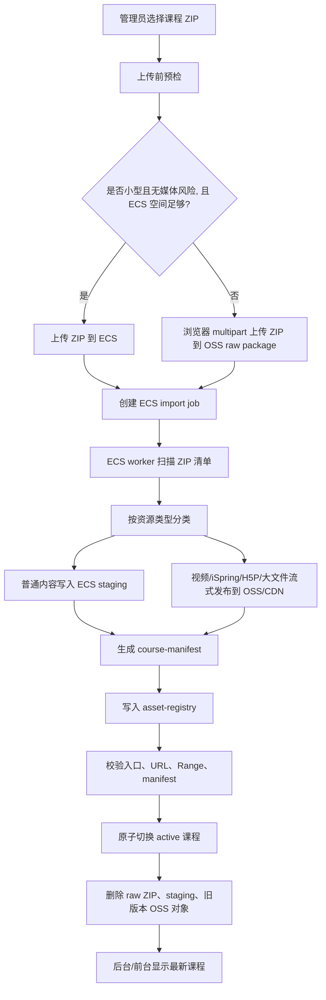

# 课程包混合导入与存储最终方案

日期：2026-08-05

## 1. 最终结论

课程包导入不再采用“先上传 OSS inbox，再由 FC 解压”的路线，也不采用“所有课程 ZIP 都先落 ECS”的单一路线。

最终路线是：

```text
浏览器负责上传原始课程 ZIP。
ECS worker 负责统一解析、分类、manifest 改写、课程激活和清理。
ECS 长期保存课程壳、HTML、小文档和普通资源。
OSS/CDN 长期保存视频、音频、iSpring、H5P 和超大下载文件。
```

入口分两类：

```text
小型、无高并发媒体课程：
  浏览器 -> ECS upload root -> ECS worker 本地处理

媒体型、大型、或超过 ECS 安全空间的课程：
  浏览器 multipart -> OSS raw package -> ECS worker 通过香港内网 endpoint 流式处理
```

关键点：

1. 是否进 OSS 不只看 ZIP 总大小，更看是否包含视频、iSpring、H5P 等高并发播放资源。
2. 视频、iSpring、H5P 最终必须进 OSS/CDN，避免 ECS 5 Mbps 公网带宽成为播放瓶颈。
3. 超过 FC 临时盘 10 GB 的课程不能交给 FC 解压。
4. 超过 ECS 安全剩余空间的课程 ZIP 不能先落 ECS。
5. 直传 OSS 只保留为“课程 ZIP raw package multipart 上传”，不保留人工 OSS inbox/FC extractor 工作流。
6. ECS worker 不把 OSS raw ZIP 完整下载到 ECS 磁盘，而是内网 read stream 逐 entry 处理。

## 2. 为什么今天的 ECS-first 方案需要修正

纯 ECS-first 的问题是：大课程里的大头通常就是视频、iSpring、H5P。它们最终仍要进 OSS/CDN。如果先把完整包上传到 ECS，再由 ECS 通过公网 endpoint 上传大媒体到 OSS，会出现两个浪费：

```text
本地 -> ECS：传一次完整大包
ECS -> OSS：再传一次大媒体
```

你的 ECS 公网带宽只有 5 Mbps，这会让 BOH4M 这类课程非常慢，也会让 ECS 磁盘承受原始 ZIP 和 staging 的峰值压力。

因此最终方案改为：

```text
大包/媒体包：浏览器直接 multipart 上传到 OSS raw package。
ECS worker：使用香港内网 OSS endpoint 读取 raw ZIP，并把媒体 entry 再通过内网上传到最终 OSS/CDN 路径。
```

这样绕开的是 ECS 公网入站/出站带宽和本地 10 GB/磁盘峰值问题，不是绕开 ECS worker 的业务处理。

## 3. 不再使用的旧路线

以下路线废弃：

```text
OSS inbox/uploads -> FC extractor -> Portal callback
```

原因：

1. FC 最高临时盘只有 10 GB，超过 10 GB 的课程天然不适合。
2. FC 对大媒体 stream 上传 OSS 时容易遇到 socket hang up。
3. FC 日志、重试、状态恢复、active 切换都不如 ECS worker 可控。
4. 课程导入不是简单解压，还涉及 manifest、registry、前台 URL、旧版本清理和回滚。

保留的直传能力不是旧 `OSS inbox`，而是新的 raw package 上传：

```text
course-import-raw/<COURSE>/<uploadId>/<original.zip>
```

当前代码里如果仍叫 `course-import-overflow`，可以先继续使用；后续建议改名为 `course-import-raw`，因为它不只是空间兜底，也是媒体/大包主入口。

## 4. 总体流程



## 5. 上传入口选择规则

### 5.1 直接上传 ECS

适用条件：

```text
ZIP 小于 COURSE_ECS_UPLOAD_MAX_GB
ECS freeBytes >= zipSize + localEstimateReserve + systemReservedBytes
文件名/历史记录/预扫描信息未显示明显媒体型课程
管理员明确选择普通课程包导入
```

适合：

```text
HTML
TXT/MD/JSON
CSS/JS
普通图片
普通 PDF/DOCX/PPTX/XLSX
无视频、无 iSpring、无 H5P 的课程
```

### 5.2 浏览器 multipart 上传 OSS raw package

适用条件：

```text
ZIP 超过 ECS 安全接收上限
ZIP 超过 COURSE_ECS_UPLOAD_MAX_GB
课程已知包含视频、iSpring、H5P
文件名或历史课程记录显示属于媒体型课程
管理员选择“大课程/媒体课程导入”
```

适合：

```text
BOH4M 这类大媒体课程
包含多个 mp4/webm/mov 的课程
包含 iSpring html5-package 的课程
包含 H5P 的课程
超过 10 GB 的课程 ZIP
```

浏览器 multipart 的含义：

```text
浏览器把一个大 ZIP 拆成多个 part 上传到 OSS。
OSS completeMultipartUpload 后生成一个完整 ZIP object。
这个合并发生在 OSS 侧，不发生在 ECS，也不占用 ECS 临时盘。
```

用户不需要手动拆包。

## 6. ECS worker 是否完整下载 ZIP

不应该完整下载到 ECS 磁盘。

合理实现：

```text
OSS raw ZIP object
  -> ECS 使用 OSS_SERVER_ENDPOINT 创建 read stream
  -> unzip parser 逐 entry 读取
  -> local entry 写入 ECS staging
  -> media/iSpring/H5P entry 通过 putStream 上传 OSS 目标路径
```

需要明确两个事实：

1. ECS worker 不保存完整 ZIP 文件，所以不会被 10 GB 临时盘或本地磁盘峰值卡住。
2. ECS worker 仍然需要顺序读取 ZIP 的字节，通常至少读完整个 ZIP 一遍，因为它要识别并处理里面的每个 entry。

这不是“下载完整 ZIP 后再处理”，而是“边读边处理”。

## 7. ECS 长期保存什么

ECS 长期保存低并发、管理型、结构型内容：

```text
course-manifest.json
catalog / roadmap / course status
HTML / HTM
JSON / TXT / MD
CSS / JS
普通图片、图标、字体
普通 PDF / DOC / DOCX / PPT / PPTX / XLS / XLSX
Moodle activity 本地占位页
课程说明、unit plan、lesson plan
```

默认阈值建议：

```text
单个普通文档 <= 100 MB：可留 ECS
单个普通图片 <= 25 MB：可留 ECS
单门课程 local 内容软上限：2 GB
```

超过阈值的普通文件可以升级到 OSS `large-files`。

## 8. OSS/CDN 长期保存什么

OSS/CDN 长期保存高并发或大流量内容：

```text
MP4 / WEBM / MOV / M4V
MP3 / M4A / WAV
H5P
iSpring package 整包
大型互动资源包
超过阈值的 PDF / PPT / ZIP / DOCX 等大附件
```

目标路径：

```text
courseware-active/<COURSE>/media/...
courseware-active/<COURSE>/ispring/...
courseware-active/<COURSE>/h5p/...
courseware-active/<COURSE>/large-files/...
```

iSpring 必须整包上 OSS/CDN，不能只把其中视频拆出来。否则相对路径、播放器脚本、字体、图片、状态文件会断。

## 9. 网络与 endpoint

需要区分浏览器 endpoint 和 ECS worker endpoint：

```env
# 浏览器直传 OSS 使用公网 endpoint
OSS_DIRECT_UPLOAD_ENDPOINT=https://oss-cn-hongkong.aliyuncs.com

# ECS worker 读写 OSS 使用香港内网 endpoint
OSS_SERVER_ENDPOINT=https://oss-cn-hongkong-internal.aliyuncs.com
```

说明：

1. 浏览器在用户本地，必须使用公网 OSS endpoint。
2. ECS 和 OSS 都在香港时，ECS worker 应使用内网 endpoint，避免 ECS 5 Mbps 公网带宽。
3. 如果配置里没有 `OSS_SERVER_ENDPOINT`，服务端脚本不应默认拿浏览器直传 endpoint 做大流量读写。

## 10. 关键环境变量

建议配置：

```env
COURSE_PACKAGE_IMPORT_MODE=hybrid-worker

COURSE_ACTIVE_ROOT=/www/wwwroot/ossd-course-portal/courseware
COURSE_ARCHIVE_ROOT=/www/wwwroot/ossd-course-portal/courseware-archive
COURSE_IMPORT_UPLOAD_ROOT=/www/wwwroot/ossd-course-portal/data/imports/uploads
COURSE_IMPORT_STAGING_ROOT=/www/wwwroot/ossd-course-portal/data/imports/staging
COURSE_IMPORT_REPORT_ROOT=/www/wwwroot/ossd-course-portal/data/imports/reports

COURSE_IMPORT_RAW_PREFIX=course-import-raw
COURSE_IMPORT_ALLOW_RAW_OSS=1
COURSE_ECS_UPLOAD_MAX_GB=2
OSS_DIRECT_UPLOAD_MAX_GB=50
OSS_DIRECT_UPLOAD_PART_MB=64

OSS_COURSEWARE_BUCKET=moodletool
OSS_DIRECT_UPLOAD_ENDPOINT=https://oss-cn-hongkong.aliyuncs.com
OSS_SERVER_ENDPOINT=https://oss-cn-hongkong-internal.aliyuncs.com
COURSEWARE_ASSET_PREFIX=courseware-active
COURSEWARE_ASSET_BASE_URL=https://cdn.moodletool.work/courseware-active
COURSEWARE_ASSET_REGISTRY_FILE=/www/wwwroot/ossd-course-portal/deployment/asset-registry.json

COURSE_LARGE_FILE_THRESHOLD_MB=100
COURSE_LARGE_IMAGE_THRESHOLD_MB=25
COURSE_LOCAL_MAX_COURSE_MB=2048

COURSE_IMPORT_DELETE_ZIP_AFTER_SUCCESS=1
COURSE_IMPORT_DELETE_RAW_ZIP_AFTER_SUCCESS=1
COURSE_IMPORT_DELETE_PUBLISHED_MEDIA_AFTER_SUCCESS=1
COURSE_IMPORT_FAILED_RETENTION_DAYS=30

COURSE_IMPORT_STORAGE_WARNING_FREE_GB=40
COURSE_IMPORT_STORAGE_GUARDED_FREE_GB=25
COURSE_IMPORT_STORAGE_BLOCKED_FREE_GB=15
COURSE_IMPORT_SYSTEM_RESERVED_GB=10
COURSE_IMPORT_WORKING_RESERVE_GB=5
```

旧 FC extractor 变量不再用于新流程：

```env
OSS_EXTRACT_CALLBACK_SECRET
PORTAL_EXTRACT_CALLBACK_BASE
OSS_EXTRACT_BUCKET
OSS_EXTRACT_ENDPOINT
```

这些变量可以在确认没有手动旧工具依赖后删除。

## 11. 空间预警与空间不足处理

ECS 空间水位：

```text
safe：正常导入
warning：允许导入，但后台提示
guarded：禁止大课程直接落 ECS，只允许 raw OSS 入口或清理
blocked：禁止新导入，只允许清理、扩容、查看报告
```

建议阈值：

```text
warning：可用空间 < 40 GB 或使用率 > 75%
guarded：可用空间 < 25 GB 或使用率 > 85%
blocked：可用空间 < 15 GB 或使用率 > 92%
系统保留空间：至少 10 GB
```

上传前预检：

```text
如果走 ECS 上传：
  freeBytes >= zipSize + importWorkingReserveBytes + systemReservedBytes

如果走 OSS raw 上传：
  freeBytes >= localBytesEstimate + activeSwitchReserveBytes + systemReservedBytes
```

运行中检查点：

```text
每处理 100 个 ZIP entry
每写入 500 MB local staging
每完成一个大媒体 object
active 切换前
cleanup 前后
```

空间不足时：

```text
暂停导入
标记 blocked-insufficient-storage
保留 report
不切换 active
不删除旧课程
提示清理或扩容后重试
```

## 12. 重试策略

可以重试，但不要复用已经断掉的 stream。

浏览器上传阶段：

```text
multipart part 失败 -> 重试该 part
浏览器刷新/断网 -> 根据 uploadId/listParts 续传未完成 part
completeMultipartUpload 失败 -> 查询 OSS 状态后重试 complete 或 abort
```

ECS worker 处理阶段：

```text
part 上传失败 -> 重试当前 part buffer
object 上传失败 -> 重新打开 ZIP read stream，定位/读取该 entry 后从头重传该 object
job 失败 -> 根据 report 只重跑失败 objects 或整个 job
```

为什么不复用已断 stream：

```text
stream 断开后内部 socket、offset、backpressure 状态已经不可信。
ZIP entry stream 通常是一次性消费对象，不能保证从中间继续读。
OSS multipart 已失败的 HTTP 请求也不能继续追加。
```

合理做法是重新打开可定位的源对象，再从明确的边界重试。

## 13. 状态模型

导入状态：

```text
preflight
uploading-ecs
uploading-raw-oss
raw-upload-complete
queued
scanning
classifying
publishing-oss
writing-local
rewriting-manifest
activating
cleanup
imported
warning
failed
blocked-insufficient-storage
```

存储状态：

```text
local-only
hybrid
large-file-hybrid
media-warning
failed
```

后台不能再用“有没有 OSS 直传记录”判断课程是否完成。正确判断：

```text
local-only + imported -> 成功
hybrid + imported + media-ready -> 成功
hybrid + imported + media-warning -> 课程可见但媒体需处理
failed -> 失败
```

## 14. 前后台需要保留和删除的功能

保留：

```text
课程包上传入口
媒体任务列表
课程导入任务列表
清理旧版本 OSS 对象
重新校验 CDN/OSS URL
失败任务重试
```

删除或隐藏：

```text
人工“直传 OSS inbox”面板
OSS 直传记录作为主流程状态
旧 FC callback 重试按钮
上传单个媒体到 inbox 后等待 FC 的入口
旧 OSS inbox/import manifest 状态判断
```

新增或调整：

```text
上传课程 ZIP 时自动选择 ECS 或 OSS raw package
大课程/媒体课程 multipart 直传 OSS raw package
ECS worker job 进度显示
空间水位显示
raw ZIP 清理状态
旧版本 OSS stale cleanup 状态
```

## 15. 同一课程覆盖与旧版本清理

用户重复上传同一门课程时，目标是覆盖旧版本，只保留最新版本。

安全顺序：

```text
1. 新版本上传完成
2. 新版本 worker 扫描和分类成功
3. 新版本 local staging 写入成功
4. 新版本媒体/iSpring/H5P 上传 OSS 成功
5. 新 manifest 和 registry 校验成功
6. active 课程原子切换到新版本
7. 删除旧 registry 中同课程有、最新 registry 没有引用的 OSS object
8. 删除旧 ECS archive/staging/raw ZIP
```

不能在第 6 步前删除旧版本，否则失败会导致线上课程不可用。

手动清理只用于历史遗留：

```bash
npm run cleanup:oss-stale -- --course BOH4M --bucket oss://moodletool --dry-run
npm run cleanup:oss-stale -- --course BOH4M --bucket oss://moodletool --apply
```

如果 registry 里没有该课程，不要直接 apply，否则会把该课程 OSS 前缀下对象全部视为 stale。

## 16. CDN 与资源可用性校验

OSS 上传成功不等于前台一定可打开。

media-ready 前至少校验：

```text
OSS object exists
object size matches expected size
CDN URL HEAD/GET 返回 200 或可接受状态
视频支持 Range 请求
iSpring 入口 HTML 可访问
manifest 中 cdn/local URL 都能解析
```

如果 Moodle URL 页面显示：

```text
External target could not be downloaded: HTTP 401
```

这通常是原 Moodle 外部链接需要登录，下载阶段无法抓取目标页面，不是混合存储机制错误。

## 17. 实施计划

### Step 1：把 raw OSS 上传升级为正式入口

当前 `course-package-overflow` 可以作为基础，但需要调整语义：

```text
旧语义：ECS 空间不足时兜底
新语义：大课程/媒体课程默认 raw package 入口
```

建议迁移命名：

```text
course-import-overflow -> course-import-raw
OSS_COURSE_PACKAGE_OVERFLOW_PREFIX -> COURSE_IMPORT_RAW_PREFIX
```

可以不做兼容，切换后新上传只写新前缀。

### Step 2：服务端使用 OSS_SERVER_ENDPOINT

所有 ECS worker、index、cleanup、publisher 脚本使用：

```text
OSS_SERVER_ENDPOINT=https://oss-cn-hongkong-internal.aliyuncs.com
```

浏览器 STS/直传仍使用：

```text
OSS_DIRECT_UPLOAD_ENDPOINT=https://oss-cn-hongkong.aliyuncs.com
```

### Step 3：上传前预检

后台选择 ZIP 后先判断：

```text
zipSize
ECS freeBytes
历史课程是否媒体型
管理员选择的导入类型
```

然后自动决定：

```text
ECS upload
OSS raw multipart upload
blocked-insufficient-storage
```

### Step 4：ECS worker 流式 ZIP 处理

worker 支持两个 source：

```text
zipSource=ecs
zipSource=oss-raw
```

`oss-raw` 必须使用内网 endpoint read stream，不落完整 ZIP 文件。

### Step 5：manifest/registry 原子切换

新 manifest、registry、active course 必须一起成功。失败时保留旧 active。

### Step 6：清理旧版本

成功导入后自动删除：

```text
raw ZIP
staging
旧版本不再引用的 OSS object
已发布 OSS 的 ECS 本地媒体副本
```

### Step 7：移除旧 UI 状态

后台不再展示“OSS 直传记录”作为课程导入主状态。

## 18. 验收清单

小型无媒体课程：

```text
上传走 ECS
导入后 local-only
前台课程可见
普通 HTML/PDF/DOCX 可打开
OSS courseware-active 可为空
```

媒体课程：

```text
上传走 OSS raw multipart
ECS worker 使用内网 endpoint 处理
普通内容在 ECS
视频/iSpring/H5P 在 OSS/CDN
前台资源链接可打开
ECS 不保留媒体长期副本
```

超过 10 GB 课程：

```text
不走 FC
不要求用户手动拆包
浏览器 multipart 上传 OSS raw ZIP
OSS complete 后得到完整 ZIP object
ECS worker 流式读取处理
```

空间不足：

```text
ECS blocked 水位时禁止直接上传 ECS
允许 raw OSS 上传后只处理可承载的 local 内容
local 内容仍超过空间时阻断，不切换 active
```

覆盖旧版本：

```text
新版本完全成功后才切换 active
切换成功后删除旧版本未引用 OSS object
只保留最新版本
```

## 19. 最终判断

这个方案保留了直传 OSS 的核心价值：大文件从用户浏览器直接进 OSS，不压 ECS 5 Mbps 公网带宽。

同时它避免了旧 FC 方案的问题：不受 10 GB 临时盘限制，不依赖 FC callback，不把复杂课程激活逻辑拆散到函数计算里。

最终原则：

```text
浏览器负责把大原包送到 OSS。
ECS worker 负责可信、可观测、可重试的业务处理。
OSS/CDN 负责长期承载高并发媒体。
ECS 只长期保存轻量课程内容和门户状态。
```
