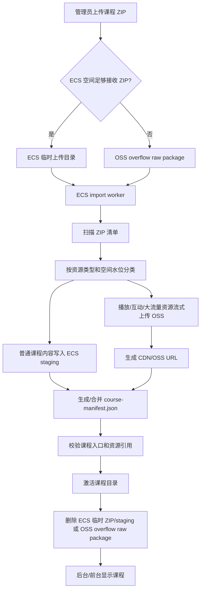

# ECS 优先的课程包混合存储方案

日期：2026-08-05

## 1. 最终结论

课程包导入主流程改为 **ECS 优先处理，按资源类型自动分流存储**。

核心结论：

1. 课程 ZIP 优先上传到 ECS 临时目录；当 ECS 空间不足以容纳原始 ZIP 时，允许上传到 OSS overflow raw package 区作为容量兜底。
2. ECS worker 负责扫描、分类、导入、生成 manifest、重写资源路径。
3. 普通课程内容长期保存在 ECS。
4. 视频、音频、iSpring、H5P、大型互动资源和超大下载文件长期保存在 OSS/CDN。
5. 已发布到 OSS/CDN 的资源，ECS 不保留长期副本。
6. OSS/CDN 的意义是承接播放并发、大流量下载和互动课件访问压力，不是替代 ECS 保存所有课程资料。
7. 原先“先上传 OSS inbox，再由 FC 解压”的方案不再作为主方案或兜底方案；OSS 只允许作为原始 ZIP overflow 暂存和最终媒体发布目标，处理仍由 ECS worker 执行。

本方案的核心边界是：

```text
处理位置：ECS worker
最终存储位置：按资源类型决定
```

不是：

```text
按 ZIP 大小决定存储位置
```

也不是：

```text
所有文件都进 OSS
```

## 2. 为什么不用 OSS inbox + FC 作为主流程

前期测试暴露了几个问题：

1. FC 对大课程包不稳定，BOH4M 这类课程在上传视频到 OSS 时可能出现 `socket hang up`。
2. FC 有执行时长、临时磁盘、网络连接和日志排查限制。
3. 课程包导入不仅是“解压文件”，还需要复杂的课程 manifest、目录、状态、路径改写和前台可见性处理。
4. 文档型课程本来不需要 OSS/CDN 承接并发播放，先进入 OSS 再回写 ECS 反而让流程变复杂。
5. 是否进入 OSS 的关键不是包大小，而是资源是否属于并发播放/大流量类型。

因此最终采用 ECS worker 作为唯一主处理链路。OSS/CDN 只作为资源发布目标，以及在 ECS 空间不足以接收原始 ZIP 时的 overflow raw package 暂存位置。OSS overflow 不触发 FC，不参与旧 callback 状态模型。

## 3. 总体流程



## 4. 存储边界

### 4.1 ECS 长期保存

ECS 保存课程管理、展示和普通访问所需内容：

```text
course-manifest.json
课程 catalog / roadmap / 状态记录
HTML / HTM 页面
JSON / TXT / MD
CSS / JS
普通图片和图标
字体文件
DOC / DOCX
PDF
PPT / PPTX
XLS / XLSX
普通 Moodle activity / URL 占位页
课程说明、unit plan、lesson plan
```

这些资源通常不是高并发播放型资源，ECS 可以承载。

### 4.2 OSS/CDN 长期保存

OSS/CDN 保存会造成播放并发、大流量或互动课件压力的资源：

```text
MP4 / WEBM / MOV / M4V
MP3 / M4A / WAV
H5P
iSpring html5-package 整包
大型互动资源包
超过阈值的单个大下载文件
```

建议阈值：

```text
单个普通文档 > 100 MB：进入 OSS large-files
单个普通图片 > 25 MB：进入 OSS large-files
单个音视频文件：始终进入 OSS/CDN
iSpring package：整个 package 始终进入 OSS/CDN
H5P：始终进入 OSS/CDN
```

### 4.3 ECS 不长期保存

以下内容任务结束后必须清理：

```text
原始课程 ZIP
staging 解压目录
已成功上传 OSS/CDN 的视频、音频、iSpring、H5P 本地副本
失败任务中过期的临时文件
重复生成的大型预览文件
```

## 5. 资源分类规则

### 5.1 Local 资源

默认留在 ECS：

```text
.html
.htm
.json
.txt
.md
.css
.js
.png
.jpg
.jpeg
.gif
.svg
.webp
.ico
.woff
.woff2
.pdf
.doc
.docx
.ppt
.pptx
.xls
.xlsx
```

但如果单个文件超过阈值，应转为 OSS large-file。

### 5.2 Media 资源

始终上传 OSS/CDN：

```text
.mp4
.webm
.mov
.m4v
.mp3
.m4a
.wav
```

### 5.3 H5P 资源

始终上传 OSS/CDN：

```text
.h5p
h5p content/libraries 中的大媒体
```

H5P 需要作为互动课件资源处理，不能只按普通压缩包或普通文档处理。

### 5.4 iSpring 资源

检测到以下路径时，整个 iSpring package 作为一个整体进入 OSS/CDN：

```text
html5-package/**
html5-package-admin/**
presentation.html 所在 package 目录
```

iSpring 不能拆散。不能只把里面的视频放 OSS，而把入口 HTML 留 ECS。否则相对路径、脚本、字体、图片、播放器状态文件容易断裂。

处理方式：

```text
ECS manifest 保留 iSpring 入口记录
真实入口 URL 改写为 CDN URL
OSS 保存完整 iSpring package
ECS 删除本地 iSpring package 副本
```

### 5.5 跳过资源

默认不导入：

```text
**/.DS_Store
**/Thumbs.db
**/*.map
**/node_modules/**
**/.git/**
**/tmp/**
**/cache/**
```

`previews-html/**` 不再默认跳过。它属于普通 HTML 预览内容，默认留 ECS，除非单文件或总量超过阈值。

## 6. ECS 容量预警与空间不足策略

ECS-first 方案必须先做容量保护，否则课程 ZIP、staging、active 切换和失败残留会把磁盘打满。

### 6.1 容量水位线

建议使用四档水位：

```text
safe          可正常导入
warning       允许导入，但后台提示并建议清理
guarded       只允许小型 local-only 导入，禁止大课程导入
blocked       禁止新导入，只允许清理和查看
```

建议默认阈值：

```text
预警水位：磁盘可用空间 < 40 GB 或使用率 > 75%
保护水位：磁盘可用空间 < 25 GB 或使用率 > 85%
阻断水位：磁盘可用空间 < 15 GB 或使用率 > 92%
系统保留空间：至少 10 GB
```

这些阈值应通过环境变量配置，不能写死。

### 6.2 上传前预检

上传开始前，Portal 必须根据 ZIP 大小和当前磁盘可用空间决定是否允许上传。

预检输入：

```text
zipSize
freeBytes
courseImportUploadRoot freeBytes
courseActiveRoot freeBytes
pendingImportBytes
reservedBytes
```

ECS 直接接收 ZIP 的最低要求：

```text
freeBytes >= zipSize + reservedBytes
```

如果 ECS 空间足够，上传到 ECS：

```text
/www/wwwroot/ossd-course-portal/data/imports/uploads/<uploadId>/<original.zip>
```

如果 ECS 空间不足以安全接收原始 ZIP，但系统仍处于可处理状态，则进入 OSS overflow raw package 兜底：

```text
course-import-overflow/<COURSE>/<uploadId>/<original.zip>
```

OSS overflow 的含义：

```text
只暂存原始 ZIP
不触发 FC
不写旧 inbox/uploads
不使用旧 callback
ECS worker 从 OSS 读取 ZIP 并继续执行扫描、分类、local staging 和 OSS/CDN 发布
```

只有当 ECS 连 local staging 预估空间也不足，或者 OSS overflow 上传不可用时，才拒绝导入：

```text
状态：blocked-insufficient-storage
提示：ECS 可用空间不足以导入本课程，请清理、扩容或降低 local 内容占用。
```

### 6.3 扫描后容量预估

ZIP 上传完成后，worker 第一阶段只读取 ZIP 清单，不全量解压。ZIP 来源可以是 ECS 本地文件，也可以是 OSS overflow object。

扫描得到：

```text
localBytesEstimate
mediaBytesEstimate
ispringBytesEstimate
h5pBytesEstimate
largeFileBytesEstimate
skippedBytesEstimate
```

关键点：

```text
media / iSpring / H5P 不应全量解压到 ECS staging。
这些资源应从 ZIP entry 流式上传 OSS/CDN。
ECS staging 只写入最终需要长期留在 ECS 的 local 内容。
```

因此空间峰值不应按：

```text
ZIP + 完整解压目录 + active 副本
```

而应按：

```text
ZIP + local staging + active 切换空间 + 系统保留空间
```

估算公式：

```text
requiredBytes =
  zipSize
  + localBytesEstimate
  + min(localBytesEstimate, existingCourseLocalBytes)
  + importWorkingReserveBytes
  + systemReservedBytes
```

如果 ZIP 在 OSS overflow，则 `zipSize` 不计入 ECS 本地峰值，但必须计入 OSS overflow retention 和清理。

如果 `requiredBytes > freeBytes`，worker 不应继续解压，应进入 `blocked-insufficient-storage`。

### 6.4 空间不足时的自动降级

如果扫描后发现 local 内容过大，系统可以自动把部分资源升级为 OSS large-files，而不是直接失败。

自动升级规则：

```text
单个 PDF/DOCX/PPTX/XLSX > COURSE_LARGE_FILE_THRESHOLD_MB -> OSS large-files
单个图片 > COURSE_LARGE_IMAGE_THRESHOLD_MB -> OSS large-files
localBytesEstimate > COURSE_LOCAL_MAX_COURSE_MB -> 从最大文件开始升级到 OSS large-files
```

升级后重新计算：

```text
localBytesEstimate
largeFileBytesEstimate
requiredBytes
```

如果仍然超过空间上限，则阻断导入并提示管理员处理。

### 6.5 空间不足时的处理顺序

当进入 `guarded` 或 `blocked`，后台应提供明确动作：

```text
1. 清理成功导入任务的原始 ZIP
2. 清理成功导入任务的 staging
3. 清理过期失败任务
4. 清理已发布 OSS/CDN 的本地媒体残留
5. 清理旧 import logs / reports
6. 清理未引用的 courseware archive
7. 扩容 ECS 数据盘
```

不能自动删除 active 课程内容，除非管理员明确执行归档或删除课程。

### 6.6 运行中保护

导入过程中 worker 必须周期性检查磁盘可用空间。

建议检查点：

```text
每处理 100 个 ZIP entry
每上传一个大型媒体 object
每写入 500 MB local staging
active 切换前
cleanup 前后
```

如果低于阻断水位：

```text
暂停继续写入
标记 job 为 blocked-insufficient-storage
保留当前 report
提示管理员清理或扩容后重试
```

### 6.7 UI 显示

后台导入页应显示：

```text
ECS 可用空间
预计需要空间
上传 ZIP 大小
预计 ECS local 内容大小
预计 OSS/CDN 发布大小
当前水位：safe/warning/guarded/blocked
```

空间不足时显示：

```text
导入暂停：ECS 可用空间不足
需要：xx GB
当前可用：xx GB
建议释放：xx GB
```

### 6.8 状态补充

导入状态新增：

```text
preflight-storage-check
blocked-insufficient-storage
cleanup-required
cleanup-running
cleanup-complete
```

这些状态不是课程内容失败，而是运维容量保护状态。

## 7. 导入处理阶段

### 7.1 上传阶段

默认上传目标：

```text
/www/wwwroot/ossd-course-portal/data/imports/uploads/<uploadId>/<original.zip>
```

空间不足时的 overflow 上传目标：

```text
course-import-overflow/<COURSE>/<uploadId>/<original.zip>
```

要求：

1. 后台上传必须登录管理员。
2. 支持大文件上传进度。
3. 支持失败重试。
4. 上传完成后创建 import record。
5. import record 状态为 `uploaded`。
6. import record 必须记录 `zipSource=ecs|oss-overflow`。
7. OSS overflow 上传完成后不触发 FC，只创建 ECS import job。

### 7.2 扫描 ZIP 清单

ZIP 上传完成后，worker 先扫描 ZIP entry metadata。

扫描阶段不写 active 课程目录，也不全量解压媒体。

输出：

```text
entry path
compressed size
uncompressed size
detected kind
target storage: local|cdn|oss-large|skip
```

ZIP 读取方式：

```text
zipSource=ecs          -> 从本地 zipPath 读取
zipSource=oss-overflow -> 从 OSS object 读取；需要支持 range/read-stream 或先按空间允许的方式分段读取
```

扫描阶段完成后执行容量预估。如果空间不足，停止在扫描阶段，不进入导入阶段。

### 7.3 写入 staging

local 内容写入目标：

```text
/www/wwwroot/ossd-course-portal/data/imports/staging/<uploadId>/
```

安全规则：

1. 禁止路径穿越：拒绝 `../`、绝对路径、Windows drive path。
2. 拒绝空文件名和控制字符。
3. 单文件大小超过硬上限时终止或转 OSS large-file。
4. 总解压大小超过硬上限时终止。
5. 解压过程写入 task log。

### 7.4 扫描分类报告

worker 扫描 staging 后生成分类清单：

```json
{
  "uploadId": "upl-...",
  "course": "BOH4M",
  "localFiles": [],
  "mediaFiles": [],
  "ispringPackages": [],
  "h5pFiles": [],
  "largeFiles": [],
  "skippedFiles": [],
  "summary": {
    "entries": 0,
    "local": 0,
    "media": 0,
    "ispring": 0,
    "h5p": 0,
    "largeFiles": 0,
    "skipped": 0
  }
}
```

### 7.5 发布 OSS/CDN

OSS 目标路径：

```text
courseware-active/<COURSE>/media/...
courseware-active/<COURSE>/ispring/...
courseware-active/<COURSE>/h5p/...
courseware-active/<COURSE>/large-files/...
```

上传要求：

1. 大文件使用 multipart upload。
2. 支持 part retry。
3. 上传完成后校验 object 存在、size 一致。
4. 写入 asset registry。
5. 生成 CDN URL。

媒体、iSpring、H5P 应尽量从 ZIP entry 流式上传 OSS/CDN，不落完整本地副本。这样即使课程包很大，ECS 磁盘压力也主要来自 ZIP 本身和 local 内容。

### 7.6 写入 ECS 课程目录

ECS active 课程目录：

```text
/www/wwwroot/ossd-course-portal/courseware/<COURSE>/
```

写入内容：

```text
普通 HTML/docs/pdf/txt/json/css/js/images
course-manifest.json
课程目录索引
Moodle activity local pages
```

写入策略：

1. 先写 staging active 目录。
2. 校验 manifest 和关键入口。
3. 校验通过后原子切换到 active。
4. 失败时保留旧 active，不破坏线上课程。

### 7.7 Manifest 改写

manifest 中每个资源必须标明来源：

```json
{
  "label": "Lesson Video",
  "type": "video",
  "source": "cdn",
  "url": "https://cdn.moodletool.work/courseware-active/BOH4M/media/video17.mp4"
}
```

```json
{
  "label": "Unit Plan",
  "type": "html",
  "source": "local",
  "path": "previews-html/.../Unit-Plan-1.docx.html"
}
```

```json
{
  "label": "iSpring Activity",
  "type": "ispring",
  "source": "cdn",
  "url": "https://cdn.moodletool.work/courseware-active/BOH4M/ispring/.../presentation.html"
}
```

前台渲染规则：

```text
source=local -> /courseware/<COURSE>/<path>
source=cdn   -> 直接使用 CDN URL
source=oss   -> 使用 OSS/CDN 映射 URL
```

### 7.8 清理本地副本

清理必须在全部校验通过后执行：

```text
OSS 上传成功
OSS size 校验成功
asset registry 写入成功
manifest 已改写
课程 active 切换成功
```

然后删除：

```text
原始 ZIP
staging 目录
已发布到 OSS 的本地媒体/iSpring/H5P 副本
```

不能边上传边删除，避免中途失败导致 ECS 和 OSS 都不完整。

## 8. 效率与工程取舍

本方案按效率和工程可控性选择默认路径。

### 8.1 为什么 ECS 仍是优先上传入口

ECS 直接接收 ZIP 的优点：

```text
处理链路短
日志和失败原因可见
不依赖 FC timeout
本地 ZIP 可重复扫描和重试
文档型课程可以一次完成导入
```

因此只要 ECS 有足够空间接收原始 ZIP，就优先走 ECS。

### 8.2 为什么 OSS overflow 只做容量兜底

OSS overflow 的优点：

```text
解决 ZIP 本体超过 ECS 可用空间的问题
避免因为原始包太大阻断导入
仍然保持 ECS worker 统一处理和统一状态模型
```

OSS overflow 的代价：

```text
worker 需要从 OSS 读取 ZIP，扫描和重试实现更复杂
随机访问 ZIP entry 可能不如本地文件高效
失败排查比本地 ZIP 稍复杂
需要额外清理 overflow raw ZIP
```

所以它不是默认路径，而是容量兜底路径。

### 8.3 为什么不恢复 FC

FC 的问题不是“不能用”，而是不适合作为课程包导入主链路：

```text
大课程包执行时间不可控
日志和中间状态不如 ECS worker 清晰
stream 上传大媒体时失败恢复复杂
课程 manifest、catalog、active 切换最终还是要回到 Portal
```

因此新方案里 OSS overflow 不能触发 FC。

### 8.4 并发策略

导入任务并发不应无限放开。

建议：

```text
同一课程并发：1
全站 import worker 并发：1-2
OSS multipart 单 object parallel：2-4
磁盘进入 warning：只允许 1 个 import job
磁盘进入 guarded：暂停大课程导入
磁盘进入 blocked：禁止新导入
```

这个并发策略牺牲一点吞吐量，换取磁盘稳定和可恢复性。

## 9. 状态模型

### 9.1 Import 状态

```text
uploaded             ZIP 已上传 ECS
extracting           正在解压
classifying          正在扫描分类
publishing-media     正在上传媒体/互动资源到 OSS
writing-local        正在写入 ECS 本地课程内容
rewriting-manifest   正在改写 manifest
activating           正在切换 active 课程
cleanup              正在清理临时文件
imported             导入完成
partial              部分完成，需要人工处理
failed               导入失败
```

### 9.2 Storage 状态

```text
local-only           课程全部长期保存在 ECS
hybrid               普通内容在 ECS，播放/互动资源在 OSS/CDN
media-only-warning   只有媒体资源，缺课程壳或 manifest
```

### 9.3 Media 状态

```text
not-required         没有视频/音频/iSpring/H5P
pending              检测到媒体，等待上传 OSS
publishing           正在上传 OSS
ready                OSS/CDN 已可用
warning              部分媒体失败或有缺失
failed               媒体发布失败
```

### 9.4 Cleanup 状态

```text
pending
running
complete
warning
failed
```

后台不能再用“有没有 OSS 文件”判断课程是否成功。正确判断：

```text
local-only + imported + media=not-required -> 成功
hybrid + imported + media=ready -> 成功
hybrid + imported + media=warning -> 可见但需处理
failed -> 失败
```

## 10. UI 行为

### 10.1 上传记录

后台上传记录应显示四段进度：

```text
上传 ECS
ECS 解包/分类
OSS/CDN 发布
课程激活
```

文档型课程示例：

```text
上传 ECS：完成
ECS 解包/分类：完成
OSS/CDN 发布：不需要
课程激活：完成
状态：local-only / imported
```

混合课程示例：

```text
上传 ECS：完成
ECS 解包/分类：完成
OSS/CDN 发布：完成
课程激活：完成
状态：hybrid / media-ready
```

### 10.2 课程列表

前台课程是否可见取决于：

```text
course-manifest.json 存在
课程 lifecycle 为 active
当前用户有权限
```

不取决于：

```text
OSS 媒体数量是否大于 0
CDN registry 是否有记录
```

### 10.3 资源打开

资源按钮逻辑：

```text
source=local -> 查看 / 下载 / 分享走 Portal
source=cdn   -> 查看 / 播放 / 下载走 CDN URL
source=oss   -> 转换为 CDN 或签名 URL
```

如果 Moodle URL 资源显示：

```text
External target could not be downloaded: HTTP 401
```

这不是存储机制失败，而是原始本地化时外部目标需要登录，未能抓取成功。

## 11. Worker 设计

### 11.1 Worker 输入

```json
{
  "uploadId": "upl-...",
  "course": "BOH4M",
  "zipSource": "ecs",
  "zipPath": "/www/wwwroot/ossd-course-portal/data/imports/uploads/upl-.../BOH4M.zip",
  "zipObjectKey": "",
  "actor": "admin"
}
```

OSS overflow 输入：

```json
{
  "uploadId": "upl-...",
  "course": "BOH4M",
  "zipSource": "oss-overflow",
  "zipPath": "",
  "zipObjectKey": "course-import-overflow/BOH4M/upl-.../BOH4M.zip",
  "actor": "admin"
}
```

### 11.2 Worker 输出

```json
{
  "ok": true,
  "course": "BOH4M",
  "storageMode": "hybrid",
  "localFiles": 1260,
  "mediaFiles": 32,
  "ispringPackages": 12,
  "h5pFiles": 4,
  "largeFiles": 2,
  "skippedFiles": 18,
  "localBytes": 524288000,
  "ossBytes": 8589934592,
  "cleanupStatus": "complete"
}
```

### 11.3 Worker 可恢复性

worker 应支持重试：

```text
解压失败 -> 从 ZIP 重新解压
OSS 上传失败 -> 只重试失败对象
manifest 改写失败 -> 重新生成 manifest
active 切换失败 -> 保留旧课程
cleanup 失败 -> 标记 warning，允许后续清理
```

上传 OSS 的每个对象应记录：

```text
sourcePath
objectKey
cdnUrl
bytes
etag
status
attempts
lastError
```

## 12. 路径规划

### 12.1 ECS 路径

```text
/www/wwwroot/ossd-course-portal/data/imports/uploads/<uploadId>/<zip>
/www/wwwroot/ossd-course-portal/data/imports/staging/<uploadId>/
/www/wwwroot/ossd-course-portal/data/imports/reports/<uploadId>.json
/www/wwwroot/ossd-course-portal/courseware/<COURSE>/
/www/wwwroot/ossd-course-portal/courseware-archive/<COURSE>/
```

### 12.2 OSS 路径

```text
course-import-overflow/<COURSE>/<uploadId>/<original.zip>
courseware-active/<COURSE>/media/...
courseware-active/<COURSE>/ispring/...
courseware-active/<COURSE>/h5p/...
courseware-active/<COURSE>/large-files/...
```

不再把原始上传 ZIP 写入旧的 `inbox/uploads/` 主入口。`course-import-overflow/` 只用于 ECS 空间不足时的原始 ZIP 暂存，不触发 FC。

### 12.3 Registry 路径

```text
/www/wwwroot/ossd-course-portal/deployment/asset-registry.json
```

Registry record 示例：

```json
{
  "course": "BOH4M",
  "kind": "video",
  "source": "cdn",
  "objectKey": "courseware-active/BOH4M/media/unit-01/video17.mp4",
  "cdnUrl": "https://cdn.moodletool.work/courseware-active/BOH4M/media/unit-01/video17.mp4",
  "bytes": 123456789
}
```

## 13. 环境变量

建议保留/新增：

```env
COURSE_PACKAGE_IMPORT_MODE=ecs-first
COURSE_ACTIVE_ROOT=/www/wwwroot/ossd-course-portal/courseware
COURSE_ARCHIVE_ROOT=/www/wwwroot/ossd-course-portal/courseware-archive

COURSE_IMPORT_UPLOAD_ROOT=/www/wwwroot/ossd-course-portal/data/imports/uploads
COURSE_IMPORT_STAGING_ROOT=/www/wwwroot/ossd-course-portal/data/imports/staging
COURSE_IMPORT_REPORT_ROOT=/www/wwwroot/ossd-course-portal/data/imports/reports
COURSE_IMPORT_ALLOW_OSS_OVERFLOW=1
OSS_COURSE_PACKAGE_OVERFLOW_PREFIX=course-import-overflow

COURSE_LOCAL_MAX_FILE_MB=100
COURSE_LOCAL_MAX_COURSE_MB=2048
COURSE_LARGE_FILE_THRESHOLD_MB=100

OSS_COURSEWARE_BUCKET=moodletool
OSS_COURSEWARE_ENDPOINT=https://oss-cn-hongkong.aliyuncs.com
COURSEWARE_ASSET_PREFIX=courseware-active
COURSEWARE_ASSET_BASE_URL=https://cdn.moodletool.work/courseware-active
COURSEWARE_ASSET_MODE=hybrid
COURSEWARE_ASSET_REGISTRY_FILE=/www/wwwroot/ossd-course-portal/deployment/asset-registry.json
OSS_DIRECT_UPLOAD_ENABLED=1
OSS_DIRECT_UPLOAD_MAX_GB=32
OSS_DIRECT_UPLOAD_PART_MB=64

COURSE_IMPORT_DELETE_ZIP_AFTER_SUCCESS=1
COURSE_IMPORT_DELETE_OVERFLOW_ZIP_AFTER_SUCCESS=1
COURSE_IMPORT_DELETE_PUBLISHED_MEDIA_AFTER_SUCCESS=1
COURSE_IMPORT_FAILED_RETENTION_DAYS=30
COURSE_IMPORT_SUCCESS_REPORT_RETENTION_DAYS=90

COURSE_IMPORT_STORAGE_WARNING_FREE_GB=40
COURSE_IMPORT_STORAGE_GUARDED_FREE_GB=25
COURSE_IMPORT_STORAGE_BLOCKED_FREE_GB=15
COURSE_IMPORT_SYSTEM_RESERVED_GB=10
COURSE_IMPORT_WORKING_RESERVE_GB=5
COURSE_LARGE_FILE_THRESHOLD_MB=100
COURSE_LARGE_IMAGE_THRESHOLD_MB=25
```

需要废弃或降级的变量语义：

```text
COURSE_PACKAGE_IMPORT_MODE=oss-only
OSS_DIRECT_UPLOAD_INBOX_PREFIX
PORTAL_EXTRACT_CALLBACK_BASE
OSS_EXTRACT_CALLBACK_SECRET
```

这些属于旧的 OSS inbox + FC extractor 方案，不再是主流程必需项。

## 14. 清理策略

### 14.1 成功导入后立即清理

```text
删除原始 ZIP
删除 staging
删除已经发布到 OSS/CDN 的媒体/iSpring/H5P 本地副本
保留 import report
保留 active 课程中的 local 文件
```

### 14.2 失败导入保留

失败时保留：

```text
原始 ZIP
staging 目录
失败报告
worker log
```

保留时间：

```text
默认 30 天
```

管理员可以手动：

```text
重试
下载报告
清理失败任务
```

### 14.3 定期维护

每日任务：

```text
扫描 data/imports/staging 过期目录
扫描 uploads 过期 ZIP
扫描 asset-registry 中 orphan OSS object
扫描 courseware active 是否引用不存在的 CDN URL
统计 ECS courseware 占用
统计 OSS courseware-active 占用
```

## 15. 典型课程处理

### 15.1 BBI2O / AVI2O 文档型课程

如果课程只包含普通 HTML、docx、pdf、URL 占位页：

```text
上传到 ECS
ECS 解压
全部或绝大部分保留 ECS
不触发 OSS 媒体发布
状态 local-only / imported / media not-required
前台课程可见
```

这种课程不需要 OSS/CDN。

### 15.2 BOH4M 媒体/iSpring 课程

如果课程包含 iSpring 和视频：

```text
上传到 ECS
ECS 解压
普通 HTML/docs 留 ECS
iSpring 整包上传 OSS/CDN
视频上传 OSS/CDN
manifest 中 iSpring/video URL 改写为 CDN
ECS 删除本地 iSpring/video 副本
状态 hybrid / media ready
```

### 15.3 大 PDF 或大 PPT 课程

如果没有视频/iSpring/H5P，但有超过阈值的大 PDF/PPT：

```text
普通课程内容留 ECS
超大 PDF/PPT 上传 OSS large-files
manifest 中该文件使用 CDN/OSS URL
状态 hybrid / large-file-ready
```

这类课程进入 OSS 的原因不是播放并发，而是单文件过大。

## 16. 验收标准

### 16.1 文档型课程

验收：

```text
课程 ZIP 上传 ECS 成功
courseware/<COURSE>/course-manifest.json 存在
前台课程可见
HTML/doc/pdf 可打开
后台显示 local-only/imported
媒体状态为 not-required
OSS 不要求存在 courseware-active/<COURSE>
```

### 16.2 媒体型课程

验收：

```text
普通课程页面可从 ECS 打开
视频从 CDN URL 播放
iSpring 从 CDN URL 打开
H5P 从 OSS/CDN 打开
asset-registry 有对应记录
ECS active 目录没有长期保留媒体/iSpring 副本
后台显示 hybrid/media-ready
```

### 16.3 清理验收

验收：

```text
成功任务原始 ZIP 已删除
staging 已删除
已发布 OSS 的媒体本地副本已删除
import report 保留
失败任务可重试
```

### 16.4 空间保护验收

验收：

```text
ECS 空间低于 blocked 阈值时禁止新课程上传
ZIP 上传后扫描阶段能估算 local/OSS/skipped 字节数
空间不足时不进入 active 切换
后台显示当前可用空间、预计需要空间和建议释放空间
成功导入后 ZIP 和 staging 被清理
媒体/iSpring/H5P 不长期留在 ECS
```

## 17. 实施步骤

### Step 1：恢复 ECS 上传为主入口

后台上传课程包时，ZIP 保存到 ECS import upload root。

完成后创建 import job：

```text
type=course-package-import
mode=ecs-first
```

### Step 2：实现 ECS import worker 分类器

分类器输出：

```text
localFiles
mediaFiles
ispringPackages
h5pFiles
largeFiles
skippedFiles
```

分类器必须先扫描 ZIP 清单并执行容量预估，不能先全量解压再判断空间。

### Step 3：实现 OSS publisher

对 media/ispring/h5p/largeFiles 上传 OSS。

要求：

```text
multipart upload
retry
size 校验
registry 写入
CDN URL 生成
```

### Step 4：实现 manifest rewrite

把发布到 OSS/CDN 的资源从：

```json
{ "path": "..." }
```

改为：

```json
{ "source": "cdn", "url": "..." }
```

Local 资源保留：

```json
{ "source": "local", "path": "..." }
```

### Step 5：实现安全清理

确认发布成功后，删除：

```text
ZIP
staging
published media local copy
```

### Step 6：实现容量守卫

实现：

```text
上传前 free space preflight
扫描后 requiredBytes 估算
运行中 free space watchdog
blocked-insufficient-storage 状态
后台清理入口
```

### Step 7：调整后台 UI

后台显示：

```text
上传 ECS
空间预检
本地导入
媒体发布
清理
```

并区分：

```text
local-only
hybrid
no-media
media-ready
large-file-ready
blocked-insufficient-storage
```

### Step 8：硬切换并移除旧 OSS inbox + FC 主链路

不再把新上传课程包默认送入：

```text
inbox/uploads/
FC extractor
PORTAL_EXTRACT_CALLBACK_BASE
```

不做兼容层：

```text
旧 OSS inbox 上传记录不进入新导入 worker
旧 FC callback 状态不映射到新状态模型
旧失败任务不自动迁移
需要修复的课程必须通过 ECS-first 重新上传课程 ZIP
新后台不提供 OSS inbox/FC extractor 的重试按钮
```

上线切换要求：

```text
关闭 OSS direct upload 入口
关闭 FC extractor 触发器
隐藏或移除 OSS 直传记录中的新建/重试操作
保留旧记录只作为审计日志，不作为可执行任务
启用新的 OSS overflow raw package 入口，但只在 ECS 空间不足以接收 ZIP 时使用
新的 OSS overflow 不写 inbox/uploads，不触发 FC
```

如果旧记录对应课程已经成功成为 active 课程，则 active 课程按现有 course-manifest 继续展示；但后续更新必须走 ECS-first 重新导入。

## 18. 漏洞复核与强制约束

以下约束必须进入实现，否则 ECS-first 方案仍然有风险。

### 18.1 ZIP 本体空间风险

ECS-first 的优先路径是原始 ZIP 能安全落到 ECS，但这不能成为硬限制。课程 ZIP 大于 ECS 可用空间时，必须走 OSS overflow raw package。

如果：

```text
zipSize + systemReservedBytes > freeBytes
```

系统不应上传到 ECS，而应改用：

处理方式：

```text
上传原始 ZIP 到 course-import-overflow/<COURSE>/<uploadId>/
创建 zipSource=oss-overflow 的 ECS import job
ECS worker 从 OSS overflow 读取 ZIP 清单和 entry stream
最终仍按资源类型写 ECS local staging 或 OSS/CDN
```

只有当 ECS 连 local staging 和 active 切换空间都不足时，才拒绝导入。

这不是旧 OSS inbox/FC 兼容链路。区别是：

```text
旧链路：OSS inbox -> FC extractor -> callback
新兜底：OSS overflow raw ZIP -> ECS worker -> ECS/OSS 分类导入
```

### 18.2 同一课程并发导入风险

同一课程同一时间只允许一个 import job 进入 active 切换流程。

必须加锁：

```text
lock key: course-import:<COURSE>
```

规则：

```text
同一课程已有 running/importing/activating job -> 新 job 排队或拒绝
不同课程可以并行，但总并发受磁盘和带宽水位限制
active 切换和 catalog 写入必须在锁内完成
```

否则两个 BOH4M 导入任务可能互相覆盖 manifest、registry 和 active 目录。

### 18.3 流式 OSS 上传重试边界

媒体、iSpring、H5P 从 ZIP entry 流式上传 OSS 时可以重试，但要分清重试层级。

不可靠方式：

```text
对已经报错并断开的同一个 stream 对象继续 retry
```

可靠方式：

```text
part 失败 -> 重试当前 part buffer
object 失败 -> 重新打开 ZIP entry stream，从头重传该 object
job 失败 -> 根据 report 只重跑失败 objects
```

正确实现：

```text
按 partSize 缓存单个分片
该分片上传成功后才能丢弃 buffer
该分片失败时重试同一 buffer
整个 object 失败时，从 ZIP 重新打开该 entry stream 重新上传
```

要求：

```text
partSize 建议 16-32 MB
每个 part retry 3-5 次
记录 uploadId/objectKey/partNumber/attempts/lastError
失败 object 可通过重新读取 ZIP entry 重试
```

不能把整个媒体文件完整写入 ECS 临时盘作为常规方案。

### 18.4 iSpring 完整性风险

iSpring package 必须按 package root 整体发布。

校验要求：

```text
presentation.html 存在
主要 data/ 依赖存在
入口 CDN URL HTTP 200
相对路径不被 manifest rewrite 破坏
```

如果 iSpring package 部分上传失败：

```text
不允许标记 media-ready
不允许删除 staging 中对应 package，除非整个 import job 失败保留
标记 mediaStatus=failed 或 warning
```

### 18.5 H5P 完整性风险

H5P 不能只按普通 zip 文件下载处理。

要求：

```text
.h5p 文件本体进入 OSS/CDN
manifest 标记 type=h5p source=cdn
如果前台需要在线解析 H5P，必须明确播放器策略
```

如果当前前台只支持下载 H5P，不支持内嵌播放，UI 要显示“下载/打开”，不能假装可播放。

### 18.6 Active 切换和回滚风险

active 切换必须在同一文件系统内完成。

推荐目录：

```text
courseware/.staging/<COURSE>/<uploadId>/
courseware/.previous/<COURSE>/<previousVersion>/
courseware/<COURSE>/
```

切换顺序：

```text
1. staging 校验通过
2. 当前 active 移到 .previous
3. staging 移到 active
4. catalog/roadmap 指向新 manifest
5. 前台 health check 通过
6. 清理旧 previous，或按保留策略保留
```

如果第 3-5 步失败，必须回滚 previous。

容量预估必须考虑 previous 保留空间；如果空间不足，不允许 active 切换。

### 18.7 Registry 与 manifest 一致性风险

asset-registry 和 course-manifest 必须一起成功。

要求：

```text
先写 registry staging
再写 manifest staging
校验 manifest 中所有 cdn/oss URL 在 registry 中可找到
active 切换时 registry 同步切换
```

不能出现：

```text
manifest 指向 CDN，但 registry 没记录
registry 有 object，但 manifest 没引用
```

orphan object 只能进入清理队列，不能在导入过程中立即删除。

### 18.8 CDN 可用性风险

OSS 上传成功不等于 CDN 可访问。

media-ready 前必须至少校验：

```text
OSS object exists
object size matches expected size
CDN URL HEAD/GET 可访问
视频支持 Range 请求
```

如果 CDN 暂时未刷新：

```text
mediaStatus=warning
课程可见
媒体入口提示发布同步中
后台允许重新校验 CDN
```

### 18.9 清理误删风险

清理只能删除 import job 自己创建的路径。

必须记录：

```text
createdLocalPaths
createdOssObjects
createdRegistryKeys
```

清理时只处理这些记录中的对象，不允许按宽泛 glob 删除 active 目录或 OSS 前缀。

### 18.10 不做兼容的切换风险

不做兼容意味着上线时必须接受：

```text
旧 OSS inbox 上传记录不能继续处理
旧 FC extractor 失败任务不能在新后台重试
旧状态模型不再参与新任务判断
```

切换当天必须执行：

```text
禁用旧上传入口
禁用 FC 触发器
确认新上传入口写入 ECS upload root
确认后台只创建 ecs-first import job
```

对于旧流程未完成课程：

```text
不迁移
不修补
要求管理员重新上传课程 ZIP
```

## 19. 最终判断

这个方案更符合项目目标：

1. 文档型课程直接由 ECS 承载，流程更简单。
2. 媒体/iSpring/H5P 自动发布到 OSS/CDN，解决并发和带宽压力。
3. 大课程不再受 FC timeout、临时盘和网络断连影响。
4. ECS 不长期保存已发布媒体，避免磁盘持续膨胀。
5. 前台课程入口稳定，资源来源由 manifest 决定。
6. 后台状态能准确区分 local-only、hybrid、no-media、media-ready。

最终原则：

```text
ECS 是导入处理中心和普通课程内容仓库。
OSS/CDN 是播放型、大流量资源仓库。
资源是否进 OSS 由资源类型和单文件阈值决定，不由 ZIP 总大小决定。
```
