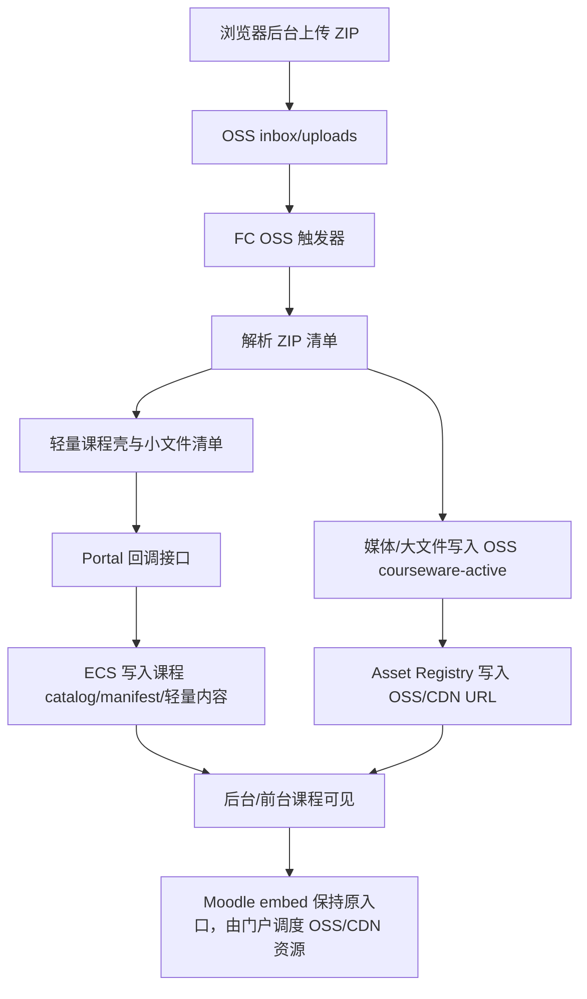

# 课程包混合存储与 OSS 媒体发布落地方案

日期：2026-08-04

## 1. 目标结论

本项目最终采用“ECS 做门户与轻量课程壳，OSS/CDN 做大媒体资源”的混合存储方案。

核心原则：

1. ECS 不再保存完整课程 ZIP，也不再保存完整媒体副本。
2. ECS 负责网站、后台、课程目录、课程状态、轻量 HTML/文本/小文档资源。
3. OSS 负责原始上传包 inbox、视频、H5P、iSpring、以及超过阈值的大附件。
4. CDN 负责播放和下载加速，优先服务 OSS 中的可播放资源。
5. 没有视频/H5P/iSpring 的课程也必须在 ECS 建立课程壳，并在后台和前台可见，状态显示为“暂无可发布媒体”或“无媒体课程”，不能当作失败。

这个方案的目的不是“所有文件都去 OSS”，而是：

- 大文件和播放压力交给 OSS/CDN。
- 管理、展示、搜索、课程入口由 ECS 提供。
- 避免 ECS 和 OSS 各存一整套课程资源造成双倍空间浪费。

## 2. 存储边界

### 2.1 ECS 保存什么

ECS 保存“课程能被管理和展示所需的轻量内容”：

- 课程记录：课程代码、标题、年级、状态、更新时间、导入批次。
- 课程 manifest/catalog：课程目录、单元、课时、资源索引。
- 课程状态：是否有媒体、媒体是否已发布、是否可播放、最后一次导入结果。
- 轻量文本/结构文件：`.json`、`.txt`、`.md`。
- 轻量 HTML 页面：课程说明页、活动入口页、必要的 index/presentation wrapper。
- HTML 依赖的小资源：`.css`、`.js`、小图片、图标、字体等。
- 小型教学文档：例如 `.pdf`、`.docx`、`.pptx`、`.xlsx`，但需要大小阈值控制。

建议阈值：

```text
单个轻量文件最大：50 MB
单门课程 ECS 轻量内容软上限：1 GB
全站 ECS 轻量内容预警：120 GB
全站 ECS 硬上限：160 GB
```

ECS 200 GB 用来存 HTML、目录、小文档、轻量活动页是够的，但不能继续保存完整 ZIP、视频副本、生成预览副本和大量重复资源。

### 2.2 OSS 保存什么

OSS 保存“播放、下载、体积大、并发压力高”的内容：

- 视频：`.mp4`、`.webm`、`.mov`、`.m4v`。
- H5P 包和 H5P 内容资源：`.h5p`、H5P content/libraries 中的大媒体。
- iSpring 完整 HTML5 package，包括其 `data/`、视频、音频、图片和脚本依赖。
- 大附件：超过 ECS 阈值的 `.pdf`、`.docx`、`.pptx`、`.xlsx`、`.zip` 等。
- 原始上传 ZIP：只放在 `inbox/uploads/`，用于导入和故障恢复，不作为长期主存储。

建议 OSS 路径：

```text
inbox/uploads/<COURSE>/<uploadId>/<original.zip>
courseware-active/<COURSE>/video/...
courseware-active/<COURSE>/h5p/...
courseware-active/<COURSE>/ispring/...
courseware-active/<COURSE>/large-files/...
```

### 2.3 默认不保存或限制保存

以下内容默认不应进入长期存储：

- 原始 ZIP 长期保留。
- `previews-html/**` 中由系统生成的大量重复预览副本。
- 临时文件、日志、缓存、source map。
- 重复的 docx 转 html 预览，如果已经有原文档或正式活动页。
- 未被课程目录引用的孤儿文件。

## 3. 关键架构



## 4. 导入流程

### 4.1 上传阶段

后台支持选择一个或多个课程 ZIP。

系统根据文件名自动识别课程代码，例如：

```text
BBI1O-course-package-20260804-081335.zip -> BBI1O
MHF4U-course-package-20260803-172155.zip -> MHF4U
```

上传行为：

1. 浏览器直接上传到 OSS，不经过 ECS 公网带宽。
2. 上传目标为 `inbox/uploads/<COURSE>/<uploadId>/<filename>.zip`。
3. 支持分片上传、断点续传、单文件取消、批量队列。
4. 上传完成后，Portal 记录 upload record。
5. OSS 触发 FC 处理 ZIP。

### 4.2 FC 解析阶段

FC 不把完整 ZIP 下载回 ECS。

FC 需要完成：

1. 读取 ZIP entry 列表。
2. 按规则判断每个 entry 属于 ECS 轻量内容、OSS 媒体内容、跳过内容。
3. 媒体和大文件解压/复制到 `courseware-active/<COURSE>/...`。
4. 生成 course import manifest。
5. 将轻量内容清单、媒体清单、跳过清单、错误清单回调给 Portal。

FC 回调必须包含：

```json
{
  "uploadId": "upl-...",
  "course": "BBI1O",
  "sourceObjectKey": "inbox/uploads/BBI1O/upl-.../BBI1O-course-package.zip",
  "targetPrefix": "courseware-active/BBI1O/",
  "entries": 334,
  "mediaExtracted": 0,
  "lightweightCandidates": 120,
  "skipped": 214,
  "status": "no-media|media-ready|partial|failed",
  "manifestObjectKey": "inbox/manifests/BBI1O/upl-.../import-manifest.json"
}
```

### 4.3 Portal 导入阶段

Portal 收到 FC 回调后：

1. 校验 `OSS_EXTRACT_CALLBACK_SECRET`。
2. 读取 FC 生成的 import manifest。
3. 创建或更新课程壳。
4. 将轻量内容写入 ECS。
5. 将 OSS/CDN 媒体写入 asset registry。
6. 更新课程状态。
7. 如果有媒体，进入媒体发布任务。
8. 如果没有媒体，课程仍然完成导入，但标记为 `no-media`。

## 5. 文件分类规则

### 5.1 ECS 轻量内容白名单

建议先使用白名单，不做“全量解压到 ECS”：

```text
.html
.htm
.json
.txt
.md
.css
.js
.png
.jpg
.jpeg
.gif
.svg
.webp
.ico
.woff
.woff2
.pdf
.doc
.docx
.ppt
.pptx
.xls
.xlsx
```

其中 `.pdf/.docx/.pptx/.xlsx` 等文档需要大小阈值：

```text
小于等于 50 MB：可放 ECS
大于 50 MB：放 OSS/CDN large-files
```

### 5.2 OSS 媒体白名单

```text
.mp4
.webm
.mov
.m4v
.mp3
.m4a
.wav
.h5p
iSpring/html5-package/**
presentation.html 所在 iSpring 包及其依赖
```

### 5.3 跳过规则

默认跳过：

```text
previews-html/**
**/.DS_Store
**/Thumbs.db
**/*.map
**/node_modules/**
**/.git/**
**/tmp/**
**/cache/**
```

`previews-html/**` 是否保留要单独评估。当前建议默认不长期保存，因为它容易产生大量重复 HTML 和文档预览，占用 ECS/OSS 空间。

## 6. HTML 依赖风险

这是本方案最容易踩坑的地方。

如果只把 `index.html` 放到 ECS，但它引用了同目录下的图片、CSS、JS、音频或视频，而这些依赖没有同步，页面会打开但资源缺失。

处理规则：

1. HTML 页面放 ECS 时，必须同时保存它引用的轻量依赖。
2. HTML 引用的视频、音频、H5P、iSpring 大资源必须改写为 OSS/CDN URL。
3. 如果 HTML 属于 iSpring 包，则整个 iSpring package 应放 OSS/CDN，不拆散到 ECS。
4. 如果 HTML 只是 Moodle 活动入口页，ECS 可以保存 HTML 和小依赖，大媒体走 OSS/CDN。

## 7. 课程状态模型

课程状态必须拆成两层：课程导入状态和媒体发布状态。

### 7.1 课程导入状态

```text
uploaded             ZIP 已上传到 OSS inbox
extracting           FC 正在解析
course-created       ECS 已创建课程壳
lightweight-imported ECS 已导入轻量内容
no-media             课程无视频/H5P/iSpring，但课程有效
imported             课程导入完成
partial              部分导入成功
failed               导入失败
```

### 7.2 媒体发布状态

```text
not-required         无媒体，不需要发布
pending              等待发布
publishing           正在写入 OSS/CDN registry
ready                媒体可播放
warning              可播放但有建议项
failed               媒体发布失败
```

### 7.3 UI 显示规则

不能再用“是否有 OSS 文件”决定课程是否存在。

正确逻辑：

```text
课程壳存在 + 无媒体 -> 前台显示课程，后台显示“暂无可发布媒体”
课程壳存在 + 媒体 ready -> 前台可播放，后台显示“媒体已发布”
课程壳存在 + 媒体 failed -> 前台可显示课程，媒体区域提示不可用
无课程壳 -> 才算课程未导入
```

BBI1O 这类课程的正确结果应该是：

```text
课程：BBI1O 已创建
ECS 轻量内容：已导入
OSS 媒体：0
媒体状态：not-required/no-media
前台：课程可见
后台：无可发布媒体，不是失败
```

## 8. 覆盖与更新策略

重复上传同一门课时：

1. 新上传包生成新的 `uploadId`。
2. 系统先导入到 staging 状态。
3. 完成校验后，原子替换课程 manifest/catalog。
4. 媒体资源按稳定路径覆盖或按版本路径切换。
5. 旧的未引用 OSS 文件进入 orphan 清理队列。
6. 旧版本保留 7-30 天用于回滚。

建议路径：

```text
courseware-active/<COURSE>/...
courseware-versions/<COURSE>/<uploadId>/...
```

短期可继续使用 `courseware-active/<COURSE>/...` 覆盖；长期建议引入版本目录，成功后切换 active 指针。

## 9. 清理与生命周期

必须配置清理，否则 OSS 和 ECS 都会慢慢膨胀。

### 9.1 OSS 生命周期

建议：

```text
inbox/uploads/ 成功导入后保留 7 天
inbox/uploads/ 失败导入保留 30 天
multipart upload 碎片保留 1-3 天后清理
courseware-versions/ 旧版本保留 30-90 天
orphan media 保留 14-30 天后删除
```

### 9.2 ECS 清理

ECS 不保留：

```text
原始 ZIP
临时解压目录
临时下载文件
旧的重复 preview
过期 job log
```

建议：

```text
job logs 保留 30 天
导入临时目录任务结束立即删除
每晚扫描 ECS courseware-local 占用并报警
```

## 10. 安全规则

必须实现：

1. Callback 使用 `OSS_EXTRACT_CALLBACK_SECRET` 校验。
2. ZIP entry 禁止路径穿越：拒绝 `../`、绝对路径、控制字符。
3. 文件类型白名单。
4. 单文件大小限制。
5. 单课程 ECS 轻量内容总大小限制。
6. MIME 和扩展名双重检查。
7. 后台上传必须要求管理员登录。
8. OSS inbox 不公开访问。
9. 播放资源通过 CDN/OSS 可读策略控制，必要时后续接入签名 URL。

## 11. 环境变量

现有必需变量：

```env
OSS_BUCKET_URI=oss://moodletool
OSS_DIRECT_UPLOAD_ENABLED=1
COURSEWARE_ASSET_BASE_URL=https://cdn.moodletool.work/courseware-active
OSS_EXTRACT_CALLBACK_SECRET=<32位以上随机密钥>
COURSE_PACKAGE_IMPORT_MODE=oss-only
PORTAL_EXTRACT_CALLBACK_BASE=https://www.moodletool.work
OSS_EXTRACT_BUCKET=moodletool
OSS_EXTRACT_ENDPOINT=https://oss-cn-hongkong.aliyuncs.com
COURSEWARE_ASSET_PREFIX=courseware-active
OSS_INBOX_PREFIX=inbox/uploads
```

建议新增：

```env
COURSE_LOCAL_CONTENT_ENABLED=1
COURSE_LOCAL_ROOT=/www/wwwroot/ossd-course-portal/data/course-local
COURSE_LOCAL_MAX_FILE_MB=50
COURSE_LOCAL_MAX_COURSE_MB=1024
COURSE_LOCAL_ALLOWED_EXT=.html,.htm,.json,.txt,.md,.css,.js,.png,.jpg,.jpeg,.gif,.svg,.webp,.ico,.woff,.woff2,.pdf,.doc,.docx,.ppt,.pptx,.xls,.xlsx
COURSE_MEDIA_ALLOWED_EXT=.mp4,.webm,.mov,.m4v,.mp3,.m4a,.wav,.h5p
COURSE_IMPORT_EXCLUDE_GLOBS=previews-html/**,**/.DS_Store,**/Thumbs.db,**/*.map,**/tmp/**,**/cache/**
OSS_RAW_ZIP_RETENTION_DAYS=7
OSS_FAILED_ZIP_RETENTION_DAYS=30
```

说明：

`COURSE_PACKAGE_IMPORT_MODE=oss-only` 的含义应调整为“原始课程 ZIP 只在 OSS，不保存到 ECS”。它不应该理解为“课程的所有内容都只在 OSS”。ECS 仍然可以保存课程壳和轻量展示内容。

## 12. 实施路线

### Step 1：修正数据模型

新增或调整字段：

```text
course.importStatus
course.mediaStatus
course.hasPlayableMedia
course.localContentStatus
course.latestUploadId
course.latestImportSummary
asset.source = local|oss|cdn
asset.kind = video|h5p|ispring|document|html|image|script|style|other
```

验收：

- BBI1O 这种 `mediaExtracted=0` 的课程不能显示成失败。
- 后台课程列表不再因 `CDN=0` 显示“不可发布媒体”而阻止课程存在。
- 前台可以看到已导入但无媒体的课程。

### Step 2：FC 输出 import manifest

FC 需要输出三类清单：

```json
{
  "course": "BBI1O",
  "lightweightFiles": [],
  "mediaFiles": [],
  "skippedFiles": [],
  "summary": {
    "entries": 334,
    "lightweight": 120,
    "media": 0,
    "skipped": 214
  }
}
```

清单保存到：

```text
inbox/manifests/<COURSE>/<uploadId>/import-manifest.json
```

验收：

- FC 测试 BBI1O 返回 `media=0`，但 `lightweight > 0`。
- FC 不再把 `extracted=0` 简化成“导入完成且可播放”。

### Step 3：Portal 导入轻量内容

Portal 根据 import manifest 从 OSS ZIP 或 FC 产物导入轻量内容到 ECS。

推荐实现方式：

1. FC 将轻量内容直接写成一个小型 `local-content.zip` 到 OSS。
2. Portal 只下载这个小包到 ECS。
3. Portal 解压到 staging 目录。
4. 校验通过后原子替换课程本地内容目录。

建议路径：

```text
data/course-local/<COURSE>/
data/course-local-staging/<COURSE>/<uploadId>/
```

验收：

- BBI1O 在 ECS 出现课程 manifest 和轻量活动入口。
- ECS 不出现原始完整 ZIP。
- ECS 不出现视频副本。

### Step 4：Asset Registry 区分 local/oss

Registry 中每个资源必须标明来源：

```json
{
  "course": "ENG3U",
  "kind": "video",
  "source": "cdn",
  "url": "https://cdn.moodletool.work/courseware-active/ENG3U/video/..."
}
```

```json
{
  "course": "BBI1O",
  "kind": "html",
  "source": "local",
  "path": "/course-local/BBI1O/..."
}
```

验收：

- 视频播放走 CDN。
- 轻量课程页面走 ECS。
- 无媒体课程不要求 CDN 数量大于 0。

### Step 5：后台 UI 调整

后台媒体中心需要拆开显示：

```text
课程导入：已导入 / 部分导入 / 无媒体 / 失败
媒体发布：可播放 / 无媒体 / 发布中 / 失败
本地内容：xx files / xx MB
OSS 媒体：xx files / xx GB
```

按钮逻辑：

- “发布媒体”只对有视频/H5P/iSpring 的课程可用。
- “导入课程壳”对所有课程包可用。
- “查看课程”对课程壳存在的课程可用。
- “无可发布媒体”是正常状态，不是失败。

### Step 6：前台展示调整

前台课程页面：

1. 课程壳存在就显示课程。
2. 有媒体则显示播放入口。
3. 无媒体则显示课程介绍、目录、文档、活动入口。
4. 媒体缺失不影响整个课程显示。

### Step 7：清理任务

新增后台维护任务：

```text
清理成功导入超过 7 天的 inbox ZIP
清理失败超过 30 天的 inbox ZIP
清理 multipart 残留
扫描 orphan OSS media
扫描 ECS 本地内容占用
```

## 13. 验收用例

### 13.1 BBI1O 无媒体课程

输入：

```text
BBI1O-course-package-20260804-081335.zip
```

预期：

```text
课程壳：已创建
ECS 轻量内容：> 0
OSS 媒体：0
媒体状态：not-required/no-media
后台：BBI1O 可见，显示“暂无可发布媒体”
前台：BBI1O 可见
播放：无视频播放入口
```

### 13.2 ENG3U 媒体课程

预期：

```text
课程壳：已创建
ECS 轻量内容：存在
OSS 视频/H5P/iSpring：存在
CDN URL：可 range 访问
后台：媒体 ready 或 warning
前台/Moodle embed：可播放
```

### 13.3 MHF4U 大 ZIP

预期：

```text
浏览器分片上传可断点续传
原始 ZIP 只在 OSS inbox
导入后 ECS 不保存完整 ZIP
视频/大文件进 OSS
小文档/HTML 进 ECS
```

## 14. 运维检查命令

生产环境检查：

```bash
cd /www/wwwroot/ossd-course-portal
npm run check:production-env -- --env .env.production
```

查看 OSS inbox：

```bash
ossutil ls oss://moodletool/inbox/uploads/BBI1O/
```

查看 OSS 媒体目录：

```bash
ossutil ls oss://moodletool/courseware-active/ENG3U/
```

查看 ECS 本地课程内容：

```bash
du -sh /www/wwwroot/ossd-course-portal/data/course-local/*
```

查看媒体任务：

```bash
ps -ef | grep -E "run-media-delivery|sync-courseware|optimize-video|ossutil" | grep -v grep
```

## 15. 当前代码需要重点修复的问题

从 BBI1O 测试结果看，当前系统已经能做到：

```text
ZIP 上传到 OSS inbox
FC 被触发
FC 能解析 ZIP
FC 能回调 Portal
Portal 能创建媒体任务
```

但还缺：

1. `mediaExtracted=0` 时不能直接显示“已导入/可播放”。
2. 需要把“课程壳导入”和“媒体发布”拆开。
3. FC 需要产出轻量内容 manifest 或 local-content.zip。
4. Portal 需要把轻量内容落到 ECS。
5. 前台课程列表需要基于课程壳显示，而不是基于 OSS/CDN 媒体数量。
6. 后台需要显示 no-media 是正常状态。

## 16. 最终判断

这个方案是当前项目更合理的长期方案：

- 解决 ECS 200G 被完整课程包和视频挤爆的问题。
- 保留网站管理、展示、下载入口的灵活性。
- 视频/H5P/iSpring 的并发压力交给 OSS/CDN。
- 没有媒体的课程也能正常存在和展示。
- 后续 Moodle embed 路径尽量不变，由门户内部决定资源来自 ECS 还是 OSS/CDN。

下一步实现优先级：

1. 先修 BBI1O：无媒体课程导入后必须前台可见。
2. 再修 lightweight import：HTML/小文档落 ECS。
3. 再完善 registry source 类型：local/oss/cdn。
4. 最后做清理任务和 UI polish。
