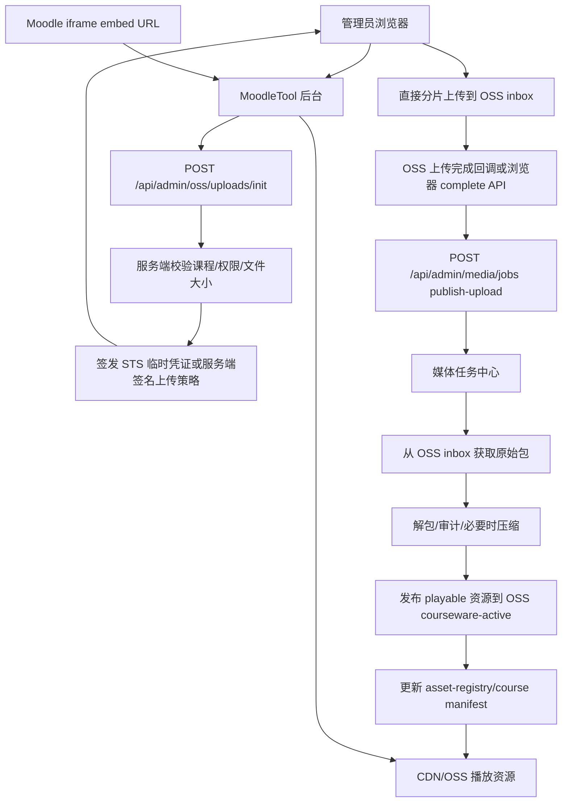

# OSS 直传与媒体任务中心落地方案

日期：2026-08-03

## 结论

后续课程资源上传要从“浏览器 -> ECS -> OSS”改为“浏览器 -> OSS”，ECS 只负责鉴权、签发临时上传凭证、创建任务、处理元数据和展示管理后台。

这样做以后：

- 大文件上传不再消耗 ECS 5Mbps 公网带宽。
- 管理员本地 20Mbps 或更高网络可以直接上传到 OSS。
- Moodle 嵌入代码保持不变，仍然使用 `https://www.moodletool.work/embed/...`。
- 播放资源内部优先走 `https://cdn.moodletool.work/courseware-active/...`，未发布资源按 `hybrid` 模式回退 ECS 本地。
- OSS 存大文件和可播放资源，ECS 存控制面、任务日志、manifest、registry 和权限数据。

## 当前基础

项目已经具备以下能力：

- `MEDIA_JOBS_ENABLED=1`：后台媒体任务中心已启用。
- `COURSEWARE_ASSET_MODE=hybrid`：资源优先走 CDN，缺失时回退本地。
- `COURSEWARE_OSS_ASSET_SCOPE=playable`：当前只发布视频、H5P、iSpring HTML5 包，避免把普通预览文档和大量小文件全部推 OSS。
- `OSS_BUCKET_URI=oss://moodletool`。
- `COURSEWARE_ASSET_BASE_URL=https://cdn.moodletool.work/courseware-active`。
- 后台已有媒体配置、课程资源状态、任务列表、日志、OSS 存储状态和进度解析。
- 现有脚本已经串起：视频审计、视频压缩、OSS 同步、CDN 预热清单、readiness 检查。

现有瓶颈是：如果管理员先把完整课件包上传到 ECS，再由 ECS 上传 OSS，大文件会被 ECS 5Mbps 带宽拖慢。直传方案解决的是“上传入口”瓶颈，不替代现有媒体发布 pipeline。

## 目标架构



关键边界：

- 浏览器上传大文件时不经过 ECS 数据转发。
- ECS 仍然是管理后台和播放入口。
- OSS `inbox` 是原始上传暂存区。
- OSS `courseware-active` 是播放区。
- `asset-registry.json` 是门户判断某个资源是否已发布到 CDN/OSS 的索引。

## 路径规划

建议 OSS 采用下面的对象前缀：

```text
oss://moodletool/inbox/uploads/{COURSE}/{uploadId}/{originalFileName}
oss://moodletool/inbox/extracted/{COURSE}/{uploadId}/...
oss://moodletool/courseware-active/{COURSE}/...
oss://moodletool/courseware-archive/{COURSE}/{yyyyMMdd-HHmmss}/...
oss://moodletool/system/manifests/{COURSE}/course-manifest.json
oss://moodletool/system/reports/{jobId}/...
```

其中：

- `inbox/uploads`：浏览器直传原始文件，例如 ZIP、H5P、单个视频、iSpring 包。
- `inbox/extracted`：可选，任务中心解包后的中间结果。第一版可以只在 ECS 临时目录解包，不一定写回 OSS。
- `courseware-active`：正式播放资源，只放可播放和需要公开/CDN 加速的资源。
- `courseware-archive`：课程覆盖前的可选备份区。
- `system`：报告、manifest 备份、registry 备份，便于灾备和审计。

上线初期不建议把所有普通文档预览、assignment HTML、folder HTML 都放 OSS。继续保持：

```env
COURSEWARE_OSS_ASSET_SCOPE=playable
```

也就是只发布视频、`.h5p`、iSpring HTML5 包。

## 存储分工

| 数据 | 存放位置 | 原因 |
| --- | --- | --- |
| 原始上传包 | OSS `inbox/uploads` | 文件大，绕开 ECS 带宽；可设置生命周期清理 |
| 可播放视频/H5P/iSpring | OSS `courseware-active` + CDN | 学生并发播放走 OSS/CDN |
| 课程 manifest | ECS 本地为主，OSS 备份可选 | 门户读取快，部署简单 |
| `asset-registry.json` | ECS 本地为主，OSS 备份可选 | `hybrid` 判定需要本地快速读取 |
| 任务日志 | ECS `data/media-jobs`，OSS 备份可选 | 后台实时读取；失败后可审计 |
| 管理员、课程权限、token | ECS | 控制面数据，不放 CDN |
| 临时解压目录 | ECS 临时目录 | 第一版落地最快；任务结束清理 |

长期原则：大文件和播放流量在 OSS/CDN，ECS 不做大文件长期存储，也不做大文件下载出口。

## 直传授权设计

前端不能拿永久 AccessKey。服务端只给短期、最小权限的上传授权。

推荐两种方式：

### 推荐：STS 临时凭证 + 浏览器分片上传

适合完整课件包、1GB 以上 ZIP、网络不稳定场景。

流程：

1. 管理员在后台选择课程和文件。
2. 前端调用 `POST /api/admin/oss/uploads/init`。
3. 服务端校验管理员权限、课程代码、文件名、大小、类型。
4. 服务端通过 RAM Role/STS 签发临时凭证。
5. 临时凭证只允许写入：

```text
oss://moodletool/inbox/uploads/{COURSE}/{uploadId}/*
```

6. 浏览器用 OSS Browser SDK 分片直传。
7. 上传完成后，浏览器调用 complete API；可同时配置 OSS Callback 做兜底通知。

建议参数：

```env
OSS_DIRECT_UPLOAD_ENABLED=1
OSS_DIRECT_UPLOAD_INBOX_PREFIX=inbox/uploads
OSS_DIRECT_UPLOAD_TOKEN_TTL_SECONDS=1800
OSS_DIRECT_UPLOAD_MAX_GB=10
OSS_DIRECT_UPLOAD_PART_SIZE_MB=16
OSS_DIRECT_UPLOAD_MAX_PARALLEL=4
```

### 可选：服务端签名 PostObject

适合小文件，简单，但对大文件断点续传和分片体验不如 STS 方案。完整课程 ZIP 推荐 STS。

## OSS CORS 配置

Bucket 需要允许后台域名直传：

```text
AllowedOrigin:
  https://www.moodletool.work

AllowedMethod:
  GET
  PUT
  POST
  HEAD

AllowedHeader:
  *

ExposeHeader:
  ETag
  x-oss-request-id
  x-oss-hash-crc64ecma

MaxAgeSeconds:
  3600
```

如果本地测试后台使用其他域名或端口，需要临时加入对应 Origin。生产环境不要长期放 `*`。

## RAM 权限

建议创建两个权限边界：

### 1. 上传临时凭证权限

只允许管理员本次 uploadId 写入 inbox：

```json
{
  "Version": "1",
  "Statement": [
    {
      "Effect": "Allow",
      "Action": [
        "oss:PutObject",
        "oss:AbortMultipartUpload",
        "oss:ListMultipartUploads",
        "oss:ListParts"
      ],
      "Resource": [
        "acs:oss:*:*:moodletool/inbox/uploads/${course}/${uploadId}/*"
      ]
    }
  ]
}
```

实际实现时 `${course}` 和 `${uploadId}` 由服务端生成并固化，不能由前端任意拼接。

### 2. ECS 媒体发布权限

ECS 上的 `ossutil` 或后端服务需要：

- 读取 `inbox/uploads`。
- 写入 `courseware-active`。
- 可选写入 `courseware-archive`、`system/reports`。
- 可选删除过期 `inbox`。

第一版可以继续使用当前已配置好的 `ossutil` RAM 用户，但后续应收敛到最小权限，不建议长期使用 `AliyunOSSFullAccess`。

## 新增 API 设计

### 创建直传任务

```http
POST /api/admin/oss/uploads/init
Content-Type: application/json
```

请求：

```json
{
  "course": "ENG4U",
  "fileName": "ENG4U-courseware.zip",
  "fileSize": 1932735283,
  "contentType": "application/zip",
  "kind": "course-package"
}
```

返回：

```json
{
  "ok": true,
  "upload": {
    "id": "upl_20260803_ENG4U_xxxxx",
    "course": "ENG4U",
    "bucket": "moodletool",
    "region": "oss-cn-hongkong",
    "endpoint": "https://oss-cn-hongkong.aliyuncs.com",
    "objectKey": "inbox/uploads/ENG4U/upl_20260803_ENG4U_xxxxx/ENG4U-courseware.zip",
    "expiresAt": "2026-08-03T10:30:00.000Z",
    "partSizeMb": 16,
    "parallel": 4
  },
  "credentials": {
    "accessKeyId": "...",
    "accessKeySecret": "...",
    "securityToken": "...",
    "expiration": "2026-08-03T10:30:00.000Z"
  }
}
```

注意：返回的是 STS 临时凭证，不是永久 AccessKey。

### 标记上传完成

```http
POST /api/admin/oss/uploads/{uploadId}/complete
Content-Type: application/json
```

请求：

```json
{
  "etag": "...",
  "size": 1932735283,
  "objectKey": "inbox/uploads/ENG4U/upl_20260803_ENG4U_xxxxx/ENG4U-courseware.zip",
  "autoPublish": true
}
```

服务端动作：

1. 使用 OSS `head` 或 `ls` 校验对象确实存在。
2. 校验对象路径属于该 uploadId。
3. 写入上传记录。
4. 如果 `autoPublish=true`，创建 `publish-upload` 媒体任务。

返回：

```json
{
  "ok": true,
  "upload": {
    "id": "upl_20260803_ENG4U_xxxxx",
    "status": "uploaded"
  },
  "job": {
    "id": "media-1785490xxxx",
    "type": "publish-upload",
    "status": "queued"
  }
}
```

### 查询上传记录

```http
GET /api/admin/oss/uploads?course=ENG4U&limit=20
GET /api/admin/oss/uploads/{uploadId}
```

用于后台显示：

- 上传文件名。
- 上传大小。
- 上传者。
- OSS object key。
- 上传状态。
- 对应媒体任务。
- 失败原因。

### 新媒体任务类型

现有任务类型基础上新增：

```text
publish-upload
```

含义：

```text
读取 OSS inbox upload -> 校验 -> 解包/归类 -> 审计视频 -> 压缩候选 -> 发布 playable 到 courseware-active -> 更新 registry -> readiness
```

## 前端后台设计

后台“媒体发布任务中心”建议分为四块。

### 1. 媒体总览

展示：

- 任务中心启用状态。
- OSS bucket。
- CDN base URL。
- Asset mode。
- Asset scope。
- Registry assets。
- OSS 对象数、OSS 已用容量、最近刷新时间。
- 当前运行任务数量。

### 2. 课程列表

每门课展示：

- 课程代码。
- 本地文件数量。
- 本地大小。
- 可播放资源数量。
- OSS/CDN 已发布数量。
- 覆盖率。
- 最新任务状态。
- 操作：发布、审计、只上传、查看日志。

课程没有本地资源时，不要显示假进度；显示 `0 B` 和 `未导入` 更清楚。

### 3. 直传上传区

新增“上传到 OSS”面板：

- 课程选择。
- 上传类型：完整课件包、单个视频、H5P、iSpring 包。
- 文件选择。
- 直接上传进度：百分比、速度、剩余时间、已上传/总大小。
- 上传完成后自动创建发布任务。
- 支持失败重试。
- 支持取消上传。

上传期间展示的是浏览器到 OSS 的进度，不是 ECS 到 OSS 的进度。

### 4. 任务列表和日志

现有任务列表需要优化为：

- 自动刷新运行任务，建议 2 秒一次。
- 运行中显示阶段、进度、当前文件。
- `warning` 必须显示具体 warning，不允许只显示一个词。
- `failed` 显示第一条关键错误，并提供“查看完整日志”。
- 日志内容用等宽字体、横向滚动，不要把 Job ID 和列名挤成竖排。

## 后端任务中心增强

### 状态刷新

前端轮询：

```http
GET /api/admin/media/jobs?limit=20
GET /api/admin/media/courses?refreshOss=0
```

运行中任务建议 2 秒轮询一次；无运行任务时 15-30 秒一次。

### 进度解析

当前脚本已经输出：

```text
OSS sync progress: 100/610 uploaded, failed 0
Video optimization progress: 1/4 optimized, failed 0
```

继续要求所有长任务输出可解析进度：

```text
UPLOAD progress: 123/610 uploaded, failed 0, bytes 123456789/1932735283
EXTRACT progress: 45/1200 files
PUBLISH progress: 80/610 assets
```

任务中心只认结构化进度，避免靠解析大段错误堆栈判断状态。

### 防止重复发布

继续使用课程锁：

```text
deployment/locks/{COURSE}.lock/owner.json
```

增强点：

- 锁内记录 `jobId`、`pid`、`startedAt`、`heartbeatAt`。
- 后台显示锁归属。
- 任务正常结束自动释放。
- 发现进程不存在且 heartbeat 超时，后台提供“清理过期锁”按钮。

不要让用户手动进终端删锁成为常规操作。

## publish-upload 执行流程

### 1. 校验上传对象

输入：

```json
{
  "uploadId": "upl_...",
  "course": "ENG4U",
  "objectKey": "inbox/uploads/ENG4U/upl_.../ENG4U-courseware.zip"
}
```

动作：

- 校验对象存在。
- 校验大小和上传记录一致。
- 校验 objectKey 不含 `..`、反斜杠、控制字符。
- 校验课程代码是已知课程或允许创建新课程。

### 2. 下载或流式解包

第一版落地方案：

```text
OSS inbox object -> ECS temp dir -> unzip -> staging dir
```

临时目录：

```text
/www/wwwroot/ossd-course-portal/data/media-jobs/{jobId}/staging
/www/wwwroot/ossd-course-portal/data/media-jobs/{jobId}/extract
```

要求：

- 开始前检查磁盘剩余空间至少为上传包大小的 2.5 倍。
- 任务完成后清理 `extract`，保留日志和 report。
- 解压必须防 zip-slip：不能写出目标目录。

后续如课程包变得很大，可改为函数计算/媒体处理服务，但第一版不需要。

### 3. 归类资源

识别：

- 视频：`.mp4`、`.webm`、`.mov`、`.m4v`。
- H5P：`.h5p`。
- iSpring：包含 `presentation.html`、`data/`、`html5-package/` 特征目录。
- 普通文档/HTML 预览：默认不发布到 OSS/CDN。

### 4. 视频审计和压缩

规则沿用现有脚本：

```bash
npm run audit:videos -- --course ENG4U --courseware-root /www/wwwroot/ossd-portal/courseware-active
npm run optimize:videos -- --apply --course ENG4U --audit deployment/video-bitrate-audit-ENG4U.json
```

如果没有压缩候选，必须显示：

```text
视频审计通过：无需要压缩的视频
```

而不是显示 warning。

### 5. 发布到 active

将 playable 资源发布到：

```text
oss://moodletool/courseware-active/{COURSE}/...
```

并写入 `asset-registry.json`：

```json
{
  "course": "ENG4U",
  "localPath": "/www/wwwroot/ossd-portal/courseware-active/ENG4U/...",
  "objectKey": "courseware-active/ENG4U/...",
  "ossUri": "oss://moodletool/courseware-active/ENG4U/...",
  "cdnUrl": "https://cdn.moodletool.work/courseware-active/ENG4U/...",
  "size": 123456,
  "contentType": "video/mp4",
  "updatedAt": "2026-08-03T00:00:00.000Z"
}
```

### 6. readiness 检查

必须检查：

- `ffmpeg` 可用。
- `ffprobe` 可用。
- `ossutil` 或 OSS SDK 可用。
- `OSS_BUCKET_URI` 已配置。
- `COURSEWARE_ASSET_BASE_URL` 已配置。
- `COURSEWARE_ASSET_MODE` 是 `hybrid` 或 `cdn`。
- `asset-registry.json` 存在且有目标课程资源。
- 视频无 `mustOptimize`。

`warning` 和 `failed` 必须有明确原因。不能因为“没有阻断”但没解析到 report 就显示 warning。

## 嵌入代码兼容

Moodle 里的短代码保持：

```text
[portal_iframe src="https://www.moodletool.work/embed/..." width="1500" height="750"]
```

不需要改成 CDN 域名。

原因：

- `www.moodletool.work/embed/...` 是鉴权和课程入口。
- token、课程权限、iframe 响应仍由 MoodleTool ECS 控制。
- 页面内的大资源 URL 由服务端根据 `asset-registry.json` 决定：
  - 已发布：返回 CDN URL。
  - 未发布：返回本地 `_protected_courseware` URL。

因此切换 OSS/CDN 后，学生和 Moodle 侧不需要重新嵌入。

## 并发与带宽影响

切换后：

- 学生播放视频、H5P、iSpring 静态资源：主要走 OSS/CDN。
- ECS 带宽只承担入口 HTML、鉴权、少量 manifest/API。
- 管理员上传大包：浏览器直接到 OSS，不占 ECS 出口。
- 中国内地没有 CDN 加速时，内地学生仍可直接访问香港 OSS/CDN 非内地区域链路，速度取决于跨境网络和运营商质量，不再受 ECS 5Mbps 限制。

如果要进一步提升跨境上传稳定性，可以开启 OSS 传输加速，并让直传 endpoint 使用加速域名。加速可能产生额外费用，先作为可选项。

## 环境变量

现有生产配置保持：

```env
OSS_BUCKET_URI=oss://moodletool
COURSEWARE_ASSET_MODE=hybrid
COURSEWARE_ASSET_BASE_URL=https://cdn.moodletool.work/courseware-active
COURSEWARE_ASSET_PREFIX=courseware-active
COURSEWARE_OSS_ASSET_SCOPE=playable
COURSEWARE_ASSET_REGISTRY_FILE=/www/wwwroot/ossd-course-portal/deployment/asset-registry.json
MEDIA_JOBS_ENABLED=1
MEDIA_JOBS_MAX_CONCURRENCY=1
MEDIA_JOBS_DATA_ROOT=/www/wwwroot/ossd-course-portal/data/media-jobs
FFMPEG_PATH=/usr/bin/ffmpeg
FFPROBE_PATH=/usr/bin/ffprobe
OSSUTIL_PATH=ossutil
```

新增：

```env
OSS_DIRECT_UPLOAD_ENABLED=1
OSS_DIRECT_UPLOAD_REGION=oss-cn-hongkong
OSS_DIRECT_UPLOAD_BUCKET=moodletool
OSS_DIRECT_UPLOAD_ENDPOINT=https://oss-cn-hongkong.aliyuncs.com
OSS_DIRECT_UPLOAD_INBOX_PREFIX=inbox/uploads
OSS_DIRECT_UPLOAD_MAX_GB=10
OSS_DIRECT_UPLOAD_TOKEN_TTL_SECONDS=1800
OSS_DIRECT_UPLOAD_PART_SIZE_MB=16
OSS_DIRECT_UPLOAD_MAX_PARALLEL=4
OSS_DIRECT_UPLOAD_CALLBACK_SECRET=change-me
OSS_DIRECT_UPLOAD_ALLOWED_ORIGINS=https://www.moodletool.work
```

可选传输加速：

```env
OSS_DIRECT_UPLOAD_ACCELERATION_ENABLED=0
OSS_DIRECT_UPLOAD_ACCELERATION_ENDPOINT=https://oss-accelerate-overseas.aliyuncs.com
```

## 上线实施清单

### 第 1 步：OSS 控制台

1. 确认 bucket：`moodletool`。
2. 保持私有 bucket。
3. 配置 CORS。
4. 配置生命周期：
   - `inbox/uploads/` 保留 30 天。
   - `inbox/extracted/` 保留 7 天。
   - `system/reports/` 可保留 180 天。
5. 可选开启传输加速，先小范围测试后再默认启用。

### 第 2 步：RAM/STS

1. 创建或复用用于 STS AssumeRole 的 RAM Role。
2. 权限限制到 `inbox/uploads/{course}/{uploadId}/*`。
3. ECS 后端持有 AssumeRole 权限。
4. 前端永远不保存永久 AccessKey。

### 第 3 步：后端直传 API

实现：

```text
POST /api/admin/oss/uploads/init
POST /api/admin/oss/uploads/{uploadId}/complete
GET  /api/admin/oss/uploads
GET  /api/admin/oss/uploads/{uploadId}
```

数据文件：

```text
data/oss-uploads/index.json
data/oss-uploads/{uploadId}/upload.json
```

### 第 4 步：前端直传页面

在媒体发布中心加入：

- 课程选择。
- 上传类型选择。
- 文件选择。
- 直传进度条。
- 上传速度和 ETA。
- 上传完成后自动发布开关。
- 上传完成后跳转或高亮对应媒体任务。

### 第 5 步：新增 publish-upload 任务

任务中心新增：

```text
publish-upload
```

该任务不从本地 `_admin_uploads` 读取，而是从 OSS `inbox/uploads` 读取 upload record。

### 第 6 步：发布过程接现有 pipeline

复用现有脚本能力：

```bash
npm run audit:videos
npm run optimize:videos
npm run sync:oss
npm run export:cdn-preheat
npm run check:media-delivery
```

短期可以先将 OSS inbox 对象拉到 ECS 临时目录，处理完成后同步 playable 到 `courseware-active`。

### 第 7 步：任务中心 UI 优化

必须包含：

- 自动刷新。
- 运行进度。
- 当前阶段。
- 当前文件。
- 关键 warning/failed 原因。
- OSS 存储用量。
- 锁状态。
- 清理过期锁按钮。

### 第 8 步：灰度测试

先用 `HFC3M` 或小课程测试：

1. 直传一个小 ZIP 到 OSS inbox。
2. 自动创建 `publish-upload`。
3. 后台看到任务 running。
4. 任务完成后状态 ready。
5. `asset-registry.json` 增加对应资源。
6. `curl -I -r 0-1023 CDN_URL` 返回 `206`。
7. Moodle 旧 embed 能播放。

再测试 `ENG4U` 这类 1GB+ 课程。

## 验收标准

功能验收：

- 管理员可以不进宝塔终端，在后台上传完整课程包到 OSS。
- 浏览器上传进度实时显示。
- 上传期间 ECS `eth0` 出口不会出现接近文件大小的持续流量。
- 上传完成后自动创建媒体发布任务。
- 任务中心能显示阶段、进度、日志和最终报告。
- `warning` 有明确原因；没有原因不允许显示 warning。
- 失败任务可以重试。
- 同一门课程不会被两个写任务同时发布。
- 旧 Moodle iframe embed 不需要修改。

技术验收命令：

```bash
cd /www/wwwroot/ossd-course-portal
npm run check:production-env -- --env .env.production
npm run check:media-delivery -- --course ENG4U --bucket oss://moodletool --cdn-base-url https://cdn.moodletool.work/courseware-active --asset-mode hybrid --ffmpeg /usr/bin/ffmpeg --ffprobe /usr/bin/ffprobe --ossutil ossutil
curl -I "https://www.moodletool.work/"
curl -I -r 0-1023 "https://cdn.moodletool.work/courseware-active/ENG4U/path/to/video.mp4"
```

期望：

- production env ready。
- media delivery ready。
- 入口站点返回 `302 /login` 或已登录页面。
- CDN 视频返回 `206 Partial Content`。

## 嵌入代码兼容策略

现有 Moodle 嵌入代码不需要批量重嵌入。

Moodle 里继续使用当前格式：

```text
[portal_iframe src="https://www.moodletool.work/embed/..." width="1500" height="750"]
```

原因是 `www.moodletool.work` 仍然是控制面入口，负责：

- 校验 token、课程权限和路径。
- 返回 iframe 页面或 iSpring/H5P/视频包装页。
- 根据 `asset-registry.json` 判断资源是否已发布到 OSS/CDN。
- 已发布资源改写为 `https://cdn.moodletool.work/courseware-active/...`。
- 未发布资源在 `COURSEWARE_ASSET_MODE=hybrid` 下回退 ECS 本地文件。

也就是说，用户看到的 Moodle embed URL 稳定不变；变的是 iframe 页面内部引用的静态资源 URL。这样可以避免几十门课在 Moodle 里重新替换 shortcode。

只有下面两种情况才需要重新生成嵌入代码：

- 课程资源的逻辑入口改变，例如 lessonId、kind、section、token payload 发生变化。
- 你主动决定把 Moodle 里嵌入入口从 `www.moodletool.work/embed/...` 换成另一个域名。

本方案不要求这样做。

## 可直接执行的上线步骤

下面按“先配置云资源，再上线代码，再灰度课程，再开放后台直传”执行。

### 1. OSS Bucket 配置

Bucket：

```text
moodletool
```

地域：

```text
中国香港
```

读写权限：

```text
私有
```

开启 CDN 回源私有 Bucket 授权后，Bucket 仍然保持私有。不要为了播放方便改成公共读。

创建或确认下面前缀：

```text
inbox/uploads/
courseware-active/
courseware-archive/
system/reports/
system/manifests/
```

OSS 生命周期建议：

```text
inbox/uploads/        30 天后转低频或删除
inbox/extracted/       7 天后删除
system/reports/      180 天后转低频
courseware-active/    不自动删除
courseware-archive/   90-180 天后转低频，可人工清理
```

### 2. OSS CORS 配置

在 OSS Bucket 的 CORS 里加一条规则：

```text
来源: https://www.moodletool.work
方法: GET, POST, PUT, HEAD
允许 Header: *
暴露 Header: ETag, x-oss-request-id, x-oss-hash-crc64ecma
缓存时间: 3600
```

如果临时从本地后台测试，可以短期加本地 Origin；测试后删掉。

### 3. CDN 配置

CDN 域名：

```text
cdn.moodletool.work
```

加速区域：

```text
全球，不包含中国内地
```

源站：

```text
OSS 域名 moodletool.oss-cn-hongkong.aliyuncs.com
端口 443
```

必须配置：

- HTTPS 证书已开启。
- Range 回源开启。
- 私有 Bucket 回源授权开启。
- 缓存规则 `/courseware-active/` 至少 30 天。
- 视频、H5P、iSpring 静态资源返回 `Cache-Control: public, max-age=2592000` 或更长。
- 费用封顶建议先设带宽封顶 150Mbps，后续按监控调整。

验证：

```bash
curl -I -r 0-1023 "https://cdn.moodletool.work/courseware-active/HFC3M/localized-moodle/video/U02L02/Food%20Trip%20Around%20the%20World.webm"
```

期望：

```text
HTTP/1.1 206 Partial Content
Accept-Ranges: bytes
Content-Range: bytes 0-1023/...
```

### 4. ECS 环境变量

生产 `.env.production` 推荐配置：

```env
COURSEWARE_ASSET_MODE=hybrid
COURSEWARE_ASSET_BASE_URL=https://cdn.moodletool.work/courseware-active
COURSEWARE_ASSET_PREFIX=courseware-active
COURSEWARE_ASSET_REGISTRY_FILE=/www/wwwroot/ossd-course-portal/deployment/asset-registry.json
COURSEWARE_OSS_ASSET_SCOPE=playable

OSS_BUCKET_URI=oss://moodletool
OSSUTIL_PATH=ossutil
FFMPEG_PATH=/usr/bin/ffmpeg
FFPROBE_PATH=/usr/bin/ffprobe

MEDIA_JOBS_ENABLED=1
MEDIA_JOBS_MAX_CONCURRENCY=1
MEDIA_JOBS_DATA_ROOT=/www/wwwroot/ossd-course-portal/data/media-jobs

OSS_DIRECT_UPLOAD_ENABLED=1
OSS_DIRECT_UPLOAD_BUCKET=moodletool
OSS_DIRECT_UPLOAD_ENDPOINT=https://oss-cn-hongkong.aliyuncs.com
OSS_DIRECT_UPLOAD_INBOX_PREFIX=inbox/uploads
OSS_DIRECT_UPLOAD_MAX_GB=10
OSS_DIRECT_UPLOAD_TOKEN_TTL_SECONDS=1800
OSS_UPLOADS_DATA_ROOT=/www/wwwroot/ossd-course-portal/data/oss-uploads
```

如果第一版用服务端签名 PostObject，还需要配置直传签名所用的 RAM AccessKey：

```env
OSS_DIRECT_UPLOAD_ACCESS_KEY_ID=...
OSS_DIRECT_UPLOAD_ACCESS_KEY_SECRET=...
```

长期建议改成 ECS RAM Role + STS，不把长期 AccessKey 放在 `.env.production`。

### 5. 代码上线命令

```bash
cd /www/wwwroot/ossd-course-portal
git pull
npm install
npm run build
npm run check:production-env -- --env .env.production
npm run check:media-delivery -- --course HFC3M --bucket oss://moodletool --cdn-base-url https://cdn.moodletool.work/courseware-active --asset-mode hybrid --ffmpeg /usr/bin/ffmpeg --ffprobe /usr/bin/ffprobe --ossutil ossutil
pm2 restart ossd-course-portal --update-env
pm2 status
```

如果 `check:media-delivery` 只提示 `ready-with-warnings`，必须点开报告看 warning 原因。没有明确原因的 warning 不能当成功处理。

### 6. 课程迁移顺序

不要一上来全量发布 54 门课。建议按下面顺序：

1. `HFC3M`：体积小，验证链路。
2. `ENG4U`：1GB 级别，验证大课程上传和任务进度。
3. `ENG3U`、`ESLEO`：已有较多资源，验证 registry 合并。
4. 其余课程按 3-5 门一批发布。

单门课程发布命令：

```bash
cd /www/wwwroot/ossd-course-portal
npm run pipeline:media-delivery -- --course ENG4U --courseware-root /www/wwwroot/ossd-portal/courseware-active --apply-oss --bucket oss://moodletool --cdn-base-url https://cdn.moodletool.work/courseware-active --asset-mode hybrid --asset-scope playable --ffmpeg /usr/bin/ffmpeg --ffprobe /usr/bin/ffprobe --ossutil ossutil
```

如果需要先压缩候选视频，再发布：

```bash
cd /www/wwwroot/ossd-course-portal
npm run pipeline:media-delivery -- --course ENG4U --courseware-root /www/wwwroot/ossd-portal/courseware-active --apply-optimize --apply-oss --bucket oss://moodletool --cdn-base-url https://cdn.moodletool.work/courseware-active --asset-mode hybrid --asset-scope playable --ffmpeg /usr/bin/ffmpeg --ffprobe /usr/bin/ffprobe --ossutil ossutil
```

后台任务中心稳定后，优先用后台按钮，不再手动敲命令。

### 7. 后台直传使用步骤

管理员后续理想操作：

1. 登录 `https://www.moodletool.work/teacher-admin`。
2. 进入“媒体发布任务中心”。
3. 选择课程。
4. 选择上传类型：
   - 完整课件包 ZIP。
   - 单个视频。
   - H5P 文件。
   - iSpring HTML5 包。
5. 选择文件。
6. 点击“直传到 OSS”。
7. 页面显示上传进度、速度、ETA。
8. 上传完成后：
   - 完整课件包 ZIP：后台先从 OSS inbox 拉取 ZIP，复用整课 ZIP 导入流程；如果审计无人工复核项，自动提交课程，再创建媒体发布任务。
   - 单个视频 / H5P：直接创建 `publish-upload` 任务，发布到 `courseware-active/{COURSE}/direct-uploads/...`。
   - iSpring HTML5 包：先进入 OSS inbox；后续接入专用解包器前，不自动覆盖课程。
9. 任务完成后，课程行显示：
   - `Coverage` 接近 100%。
   - `Latest` 为 `ready`。
   - 已发布资源数增加。
10. 用 Moodle 旧 embed 打开确认播放。

如果上传的是 iSpring 单包，或完整 ZIP 审计后存在需要人工确认的条目，后台必须明确提示：

```text
iSpring 包已直传到 OSS inbox；当前自动发布只支持完整课件包、单个视频和 H5P。
Package preview contains items that need manual review before commit.
```

这类提示不能伪装成成功发布。完整 ZIP 只有在“导入成功 + 媒体任务创建成功或明确提示媒体任务未创建原因”后，才算自动发布链路完成。

### 8. 故障排查命令

查看任务：

```bash
cd /www/wwwroot/ossd-course-portal
ls -lt data/media-jobs | head
```

查看日志：

```bash
tail -n 120 data/media-jobs/JOB_ID/stdout.log
tail -n 120 data/media-jobs/JOB_ID/stderr.log
```

查看课程锁：

```bash
find /www/wwwroot/ossd-course-portal/deployment/locks -maxdepth 2 -type f -o -type d
```

确认无相关进程后，才允许清理陈旧锁：

```bash
ps -ef | grep -E "run-media-delivery|sync-courseware|optimize-video|ossutil" | grep -v grep
rm -rf /www/wwwroot/ossd-course-portal/deployment/locks/ENG4U.lock
```

查看 OSS 是否有对象：

```bash
ossutil ls oss://moodletool/courseware-active/ENG4U/
```

查看 CDN 是否可 Range 播放：

```bash
curl -I -r 0-1023 "https://cdn.moodletool.work/courseware-active/ENG4U/path/to/video.mp4"
```

### 9. 成本和并发假设

这套方案的并发能力主要由 OSS/CDN 承担，不由 ECS 5Mbps 公网带宽承担。

保守估算：

- 80 名学生。
- 同时在线 50+。
- 单个视频压缩后平均 0.8-1.2Mbps。
- 若 50 人同时播放不同片段，总边缘出口峰值大约 40-60Mbps。
- 建议 CDN 带宽封顶先设 150Mbps，避免异常成本。
- CDN 流量包建议先买 5TB/年；不足再追加。
- OSS 存储几十门课预计仍远低于 CDN 流量费用，重点监控 CDN 下行流量。

如果以后备案并开启中国内地 CDN，同一套 `asset-registry` 和 embed 入口仍可继续使用，只需要调整 CDN 加速区域和 DNS。

## 回滚方案

如果直传上线后出现问题：

1. 设置：

```env
OSS_DIRECT_UPLOAD_ENABLED=0
```

2. 重启：

```bash
cd /www/wwwroot/ossd-course-portal
npm run build
pm2 restart ossd-course-portal --update-env
```

3. 后台隐藏直传入口。
4. 已发布到 `courseware-active` 的资源继续可播放。
5. 已上传到 `inbox` 的原始包保留，后续可重新处理。
6. 旧的命令行发布方式仍可使用：

```bash
npm run pipeline:media-delivery -- --course ENG4U --courseware-root /www/wwwroot/ossd-portal/courseware-active --apply-optimize --apply-oss --bucket oss://moodletool --cdn-base-url https://cdn.moodletool.work/courseware-active --asset-mode hybrid --asset-scope playable --ffmpeg /usr/bin/ffmpeg --ffprobe /usr/bin/ffprobe --ossutil ossutil
```

## 风险与处理

| 风险 | 处理 |
| --- | --- |
| 大 ZIP 解压仍消耗 ECS 磁盘 | 解压前检查剩余空间；任务结束清理；必要时提高云盘 |
| 浏览器上传中断 | STS + 分片上传，支持重试/续传 |
| 上传凭证泄露 | TTL 30 分钟，限制 prefix，限制大小，限制课程 |
| 用户上传错误课程 | 上传记录绑定课程，发布前二次确认 |
| 同课并发发布覆盖 | 课程锁 + 后台禁止重复写任务 |
| registry 写坏 | 原子写入：写临时文件后 rename；保留上一版 |
| CDN 缓存旧内容 | 对覆盖资源使用版本化文件名或发布后刷新/预热 |
| 内地访问非内地 CDN/OSS 波动 | 保持视频码率低；必要时备案后开启内地 CDN |

## 推荐开发顺序

一次做完整任务中心，但代码提交按下面顺序拆分，便于测试：

1. 后端上传记录模型和数据目录。
2. STS/服务端签名直传 API。
3. 前端直传上传组件。
4. `publish-upload` 任务类型。
5. OSS inbox 到 staging 的处理器。
6. 任务中心进度、warning、日志 UI 完整优化。
7. OSS 存储状态和锁状态面板。
8. 灰度测试和回滚开关。

## 阿里云官方依据

- 阿里云 OSS 官方说明：客户端直传可以绕过业务服务器，减少服务器带宽和资源消耗，并可通过 STS 临时凭证上传。
- 阿里云 OSS 服务端签名直传：服务端生成临时凭证和上传策略，Web 端直接上传到 OSS。
- 阿里云 OSS 上传回调：PutObject、PostObject、CompleteMultipartUpload 支持上传完成后回调业务服务器；回调失败不影响文件已保存到 OSS。
- 阿里云 OSS 传输加速：适合跨地域上传/下载，使用加速 endpoint，实际效果受网络和跨境链路影响。

参考：

- https://help.aliyun.com/en/oss/user-guide/uploading-objects-to-oss-directly-from-clients/
- https://help.aliyun.com/zh/oss/user-guide/obtain-signature-information-from-the-server-and-upload-data-to-oss
- https://help.aliyun.com/zh/oss/upload-callbacks-12
- https://help.aliyun.com/zh/oss/developer-reference/callback/
- https://help.aliyun.com/zh/oss/user-guide/transfer-acceleration
