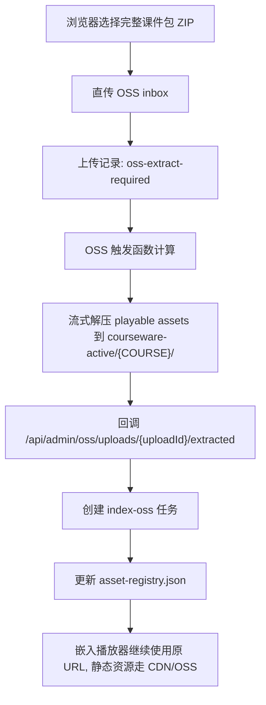

# OSS-only 完整课件包云端解压落地方案

目标：ECS 只承担网站、后台、上传授权、任务编排和页面入口；完整课件包 ZIP 与可播放资源只保存在 OSS，通过 CDN 播放/下载。

## 已实现边界

- 浏览器直传完整课件包到 OSS inbox：`inbox/uploads/{COURSE}/{uploadId}/{filename}.zip`
- 网站端不再下载 ZIP 到 ECS 导入，上传完成后记录为 `oss-extract-required`
- 新增云端解压 worker：`functions/oss-course-package-extractor/index.mjs`
- worker 流式读取 OSS ZIP，仅抽取可播放资源到 `courseware-active/{COURSE}/`
- worker 回调网站：`POST /api/admin/oss/uploads/{uploadId}/extracted`
- 网站收到可信回调后创建 `index-oss` 任务，刷新 `deployment/asset-registry.json`

## 存储策略

保留在 OSS：
- 完整课件包原始 ZIP：`inbox/uploads/...`
- 视频：`.mp4`、`.webm`、`.mov`、`.m4v`
- H5P：`.h5p`
- iSpring HTML5 包：路径包含 `/html5-package/` 或 `/html5-package-admin/` 的完整目录内容

不再为了发布复制到 ECS：
- 大视频文件
- H5P 文件
- iSpring 静态资源
- 完整课程 ZIP

ECS 保留：
- 网站程序
- 管理后台数据
- 小型索引/任务记录
- `asset-registry.json`
- 已有课程 manifest/catalog 元数据

## 生产环境变量

网站 `.env.production`：

```bash
COURSE_PACKAGE_IMPORT_MODE=oss-only
OSS_EXTRACT_CALLBACK_SECRET=至少32位随机字符串
PORTAL_EXTRACT_CALLBACK_BASE=https://www.moodletool.work
OSS_EXTRACT_BUCKET=moodletool
OSS_EXTRACT_REGION=oss-cn-hongkong
OSS_EXTRACT_ENDPOINT=https://oss-cn-hongkong.aliyuncs.com
OSS_EXTRACT_ACCESS_KEY_ID=你的RAM AccessKey
OSS_EXTRACT_ACCESS_KEY_SECRET=你的RAM Secret
```

函数计算环境变量：

```bash
OSS_EXTRACT_BUCKET=moodletool
OSS_EXTRACT_REGION=oss-cn-hongkong
OSS_EXTRACT_ENDPOINT=https://oss-cn-hongkong.aliyuncs.com
OSS_EXTRACT_ACCESS_KEY_ID=同一个或专用RAM AccessKey
OSS_EXTRACT_ACCESS_KEY_SECRET=对应Secret
OSS_EXTRACT_CALLBACK_SECRET=和网站完全一致
PORTAL_EXTRACT_CALLBACK_BASE=https://www.moodletool.work
COURSEWARE_ASSET_PREFIX=courseware-active
COURSEWARE_OSS_ASSET_SCOPE=playable
OSS_DIRECT_UPLOAD_INBOX_PREFIX=inbox/uploads
```

建议后续把 AccessKey 换成函数计算 RAM Role。当前实现兼容 AccessKey，便于先落地。

## 函数计算部署

1. 在阿里云函数计算创建 Node.js 运行时函数。
2. 上传代码目录：`functions/oss-course-package-extractor/`，同时包含项目依赖。
3. 安装依赖：

```bash
npm install --omit=dev
```

4. 函数入口：

```text
index.handler
```

5. 配置 OSS 触发器：

```text
Bucket: moodletool
事件: ObjectCreated:PutObject / ObjectCreated:CompleteMultipartUpload
前缀: inbox/uploads/
后缀: .zip
```

6. 函数内存建议：`1024 MB` 起，超时建议 `900 秒` 起。大 ZIP 以流式处理，不依赖 ECS 磁盘。

## 本地/服务器手动验证

可以先对一个已上传 ZIP 手动执行：

```bash
cd /www/wwwroot/ossd-course-portal
npm run extract:oss-package -- \
  --bucket moodletool \
  --object-key "inbox/uploads/MHF4U/upl-xxx/MHF4U-course-package.zip" \
  --portal-callback "https://www.moodletool.work/api/admin/oss/uploads/upl-xxx/extracted"
```

验证网站配置：

```bash
npm run check:production-env -- --env .env.production
```

验证 CDN 文件：

```bash
curl -I -r 0-1023 "https://cdn.moodletool.work/courseware-active/MHF4U/path/to/video.mp4"
```

期望看到：

```text
HTTP/1.1 206 Partial Content
x-oss-cdn-auth: success
```

## 后台状态流转



## 注意事项

- 嵌入代码不需要重做，URL 仍然走 `https://www.moodletool.work/embed/...`。
- 网站根据 `asset-registry.json` 把静态资源映射到 CDN；用户看到的入口路径保持稳定。
- 当前 OSS-only 只迁移“大文件和可播放资源”。课程目录、课程标题、权限和任务数据仍由网站管理。
- 如果完整课件包新增了资源，重复上传同一课程的新 ZIP 后，worker 会覆盖同名 OSS 对象；`index-oss` 会重建该课程 registry。
- 原始 ZIP 会留在 `inbox/uploads/`。可设置 OSS 生命周期规则：保留 7 到 30 天后自动转低频或删除。
