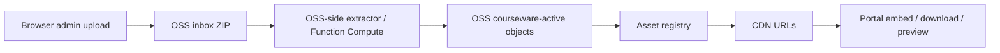

# OSS-only course package ingestion

## Goal

ECS is only the web/admin entry point. Course package files and extracted playable assets should live in OSS/CDN, not in both ECS and OSS.

This avoids:

- ECS disk growing with duplicate course packages.
- ECS public bandwidth becoming part of playback or large upload delivery.
- Confusion between local courseware state and OSS/CDN published state.

## Current boundary

Direct browser upload writes the complete ZIP to:

```text
oss://moodletool/inbox/uploads/{COURSE}/{uploadId}/{filename}.zip
```

The server records metadata in the OSS upload store and exposes it in the media admin panel.

By default:

```text
COURSE_PACKAGE_IMPORT_MODE=oss-only
```

When a complete course package upload finishes, the server now records:

```json
{
  "status": "uploaded",
  "importMode": "oss-only",
  "importStatus": "oss-extract-required",
  "ossOnly": true
}
```

It does not run `ossutil cp` to download the ZIP back to ECS.

## Legacy escape hatch

For emergency recovery only:

```text
COURSE_PACKAGE_IMPORT_MODE=legacy-local
```

This restores the old behavior:

1. Download ZIP from OSS to ECS.
2. Extract and review locally.
3. Commit into `COURSE_ACTIVE_ROOT`.
4. Create the media publish job.

Do not use this as the normal production path.

## Target OSS-only pipeline



## Extractor contract

The OSS-side extractor or worker should:

1. Watch `inbox/uploads/{COURSE}/{uploadId}/`.
2. Read `{filename}.zip` from OSS.
3. Extract playable assets directly back into OSS under:

```text
courseware-active/{COURSE}/...
```

4. Preserve only the playable scope unless configured otherwise:

- videos
- H5P packages and runtime files
- iSpring HTML5 package files
- required CSS/JS/image/font/media assets referenced by those packages

5. Write a manifest/report object, for example:

```text
inbox/uploads/{COURSE}/{uploadId}/ingest-result.json
```

Suggested result:

```json
{
  "ok": true,
  "course": "MHF4U",
  "uploadId": "upl-...",
  "sourceZip": "oss://moodletool/inbox/uploads/MHF4U/upl-.../MHF4U-course-package.zip",
  "assetPrefix": "courseware-active/MHF4U/",
  "filesExtracted": 1234,
  "bytesExtracted": 987654321,
  "playableFiles": 610,
  "skippedFiles": 11618,
  "warnings": []
}
```

6. Notify the portal or let the portal poll this result.

When the extractor finishes, call the portal callback:

```http
POST /api/admin/oss/uploads/{uploadId}/extracted
Content-Type: application/json
```

Body:

```json
{
  "targetPrefix": "courseware-active/MHF4U/",
  "extractor": "function-compute",
  "summary": {
    "filesExtracted": 1234,
    "bytesExtracted": 987654321,
    "playableFiles": 610,
    "skippedFiles": 11618,
    "warnings": []
  }
}
```

The portal stores this as `oss-extract-result.json`, marks the upload as `oss-index-queued`, and creates an `index-oss` media job. It still does not download the ZIP or extracted assets to ECS.

## Portal follow-up work

The portal follow-up job turns `oss-extract-required` into publishable registry state without downloading the package or extracted assets to ECS:

1. Receive `/extracted` callback or detect `ingest-result.json`.
2. Validate extracted OSS keys and required entry files.
3. Generate/update `asset-registry.json` from OSS object listing:

```bash
npm run index:oss -- --apply --course MHF4U --bucket oss://moodletool --cdn-base-url https://cdn.moodletool.work/courseware-active
```

For a full refresh:

```bash
npm run index:oss -- --apply --all --bucket oss://moodletool --cdn-base-url https://cdn.moodletool.work/courseware-active
```

4. Mark upload:

```json
{
  "importStatus": "indexed",
  "status": "imported",
  "jobId": "media-..."
}
```

No step should copy the full package or extracted assets into ECS courseware storage.

ECS may keep only small operational files:

- upload records under the media-job/upload data directory
- `oss-ingest-handoff.json`
- job logs and reports
- `asset-registry.json`

It must not keep the original ZIP or the extracted course resources as a second courseware copy.

## Admin panel behavior

The media panel should show:

- `直传 OSS`: complete after browser upload.
- `OSS 解压`: active while waiting for OSS-side extractor.
- `索引 Registry`: starts after the extractor callback.
- `可播放`: ready after CDN/OSS URLs are published.

The local ZIP import panel remains as a small-package/emergency maintenance tool, not the default production workflow.
