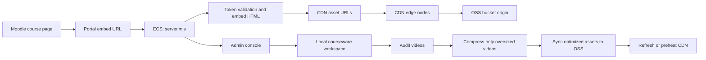

# 课程资源播放并发、视频压缩、OSS + CDN 全局方案

更新时间：2026-07-30

本文用于规划 OSSD Course Portal 在 Moodle iframe 嵌入播放场景下的并发承载方案。目标是支撑约 50-100 名学生同时使用，同时控制服务器带宽成本、CDN 流量成本和后台资源维护风险。

## 1. 目标结论

推荐采用：

```text
ECS Portal + 本地处理工作区
  + 视频审计与按需压缩
  + OSS 静态资源仓库
  + CDN 边缘分发
```

核心分工：

```text
Moodle
  -> iframe 打开 Portal embed 页面
  -> Portal 负责鉴权、token 校验、课程入口页面
  -> 视频、图片、JS、CSS、iSpring data 资源走 CDN
  -> CDN 源站为 OSS
  -> ECS 服务器不再承担大规模视频下行流量
```

结论：

- 现有 5 Mbps ECS 可以保留，用于 Portal、后台管理、鉴权和小页面输出。
- 视频播放并发不应依赖 ECS 公网带宽，而应交给 CDN。
- OSS 负责发布后的静态资源存储。
- CDN 负责学生侧大流量分发。
- 视频压缩仍然需要做，因为 CDN 解决分发并发，不解决单文件码率过高导致的流量成本和播放卡顿。
- 压缩策略必须是“审计优先、按需压缩、可回滚发布”，不能一上来批量覆盖所有线上视频。

## 2. 当前项目基础

当前项目已经具备一部分并发和播放基础：

- `/embed/ispring/:course/:lessonId/:resourceId?token=...` 输出 iSpring iframe 页面。
- `/embed/video/:course/:lessonId/:resourceId?token=...` 输出视频播放页面。
- `/embed/t/:token/:course/:path` 输出 token 保护的内部资源。
- `server.mjs` 已支持 Range 请求，视频可以返回 `206 Partial Content`。
- 生产环境已配置 `X_ACCEL_COURSEWARE_PREFIX=/_protected_courseware/`，可通过 Nginx `X-Accel-Redirect` 让静态文件由 Nginx 输出。
- Nginx 内部目录 `/_protected_courseware/` 已支持：

```nginx
location /_protected_courseware/ {
    internal;
    alias /www/wwwroot/ossd-portal/courseware-active/;
    autoindex off;
    add_header Accept-Ranges bytes always;
    add_header X-Content-Type-Options nosniff always;
    add_header Cache-Control "private, max-age=604800" always;
}
```

这说明当前 ECS 直出方案已经比 Node 直接流视频安全，但它仍然受限于 ECS 5 Mbps 公网带宽。OSS + CDN 是下一阶段的主要优化。

## 3. 为什么用了 OSS + CDN 仍然要做视频压缩

CDN 解决的是“很多学生同时下载时由谁来分发”的问题；视频压缩解决的是“每个学生下载多少数据”的问题。

如果一个视频码率为 8.93 Mbps：

```text
100 人同时播放 ~= 893 Mbps CDN 下行
15 分钟观看流量 ~= 8.93 * 900 / 8 / 1024 = 0.98 GB/人
100 人看一次 ~= 98 GB
```

如果压到 1.2 Mbps：

```text
100 人同时播放 ~= 120 Mbps CDN 下行
15 分钟观看流量 ~= 1.2 * 900 / 8 / 1024 = 0.13 GB/人
100 人看一次 ~= 13 GB
```

所以，压缩的价值是：

- 降低 CDN 年度流量包消耗。
- 降低学生端网络压力。
- 改善视频首屏加载和拖动体验。
- 降低移动网络、校园 Wi-Fi、跨地区访问时的卡顿概率。

## 4. 总体架构



生产访问路径：

```text
https://www.moodletool.work/embed/ispring/ENG3U/U01L01/xxx?token=...
  -> Portal 返回 HTML
  -> HTML 中课件资源指向：
     https://cdn.moodletool.work/courseware-active/ENG3U/...
```

兼容路径：

```text
https://www.moodletool.work/embed/t/<token>/ENG3U/.../video12.mp4
```

兼容路径短期保留，用于：

- 未迁移到 OSS/CDN 的课程。
- 管理员预览。
- 故障回退。
- 权限更严格的资源。

长期目标是让大文件不通过 ECS 输出。

## 5. 文件存储模型

### 5.1 本地服务器目录

本地目录仍然保留，作为源文件、处理工作区和回滚依据。

```text
/www/wwwroot/ossd-portal/courseware-active/
  ENG3U/
  HFC3M/
  SBI3U/

/www/wwwroot/ossd-portal/courseware-staging/
  ENG3U/
  HFC3M/

/www/wwwroot/ossd-portal/courseware-backups/
  video-originals/
```

用途：

- `courseware-active/`：当前发布版本，也可作为 OSS 同步源。
- `courseware-staging/`：压缩、检查、灰度发布工作区。
- `courseware-backups/`：压缩前原始视频备份。

### 5.2 OSS 目录

OSS 路径建议和本地相对路径保持一致：

```text
oss://moodletool-courseware/courseware-active/ENG3U/...
oss://moodletool-courseware/courseware-active/HFC3M/...
oss://moodletool-courseware/courseware-active/SBI3U/...
```

CDN URL：

```text
https://cdn.moodletool.work/courseware-active/ENG3U/...
```

这样可以减少路径转换复杂度，也便于从本地 manifest 映射到 CDN URL。

### 5.3 资源登记表

建议新增资源登记文件：

```text
deployment/asset-registry.json
```

记录每个发布资源的状态：

```json
{
  "course": "ENG3U",
  "localPath": "courseware-active/ENG3U/Unit 1/Lesson 1/html5-package/data/video12.mp4",
  "ossKey": "courseware-active/ENG3U/Unit 1/Lesson 1/html5-package/data/video12.mp4",
  "cdnUrl": "https://cdn.moodletool.work/courseware-active/ENG3U/Unit%201/Lesson%201/html5-package/data/video12.mp4",
  "contentType": "video/mp4",
  "size": 1174784,
  "sha256": "...",
  "durationSeconds": 180,
  "bitrateMbps": 1.2,
  "width": 1280,
  "height": 720,
  "optimized": true,
  "publishedAt": "2026-07-30T00:00:00.000Z"
}
```

后续可以从 JSON 升级到 SQLite，但第一阶段用 JSON 更轻。

## 6. 视频审计机制

### 6.1 审计目标

审计脚本只读取文件，不修改课程资源。

输出：

- 文件路径。
- 所属课程。
- 是否来自 iSpring package。
- 文件格式。
- 文件大小。
- 时长。
- 平均码率。
- 分辨率。
- 是否支持常见浏览器播放。
- 是否需要压缩。
- 建议目标码率。

### 6.2 推荐命令

计划新增：

```bash
npm run audit:videos -- --all
npm run audit:videos -- --course HFC3M
npm run audit:videos -- --course ENG3U --format markdown
```

输出文件：

```text
deployment/video-bitrate-audit.json
deployment/video-bitrate-audit.md
deployment/video-bitrate-audit-HFC3M.json
deployment/video-bitrate-audit-HFC3M.md
```

### 6.3 审计规则

默认规则：

```text
<= 2.0 Mbps: ok，不处理
2.0-3.0 Mbps: watch，观察
3.0-5.0 Mbps: should-optimize，建议压缩
> 5.0 Mbps: must-optimize，必须压缩
```

大文件附加规则：

```text
> 100 MB 且 > 2 Mbps: should-optimize
> 200 MB: should-optimize，即使码率不高也进入人工复核
```

格式规则：

```text
mp4: 优先保留 mp4，输出 H.264 + AAC
webm: 默认保留 webm，不自动改扩展名
mov/avi/mkv: 建议转 mp4，但需要确认引用路径
```

### 6.4 ffprobe 依赖

审计依赖 `ffprobe`：

```bash
ffprobe -v error -show_entries format=duration,bit_rate -show_entries stream=width,height,codec_name,codec_type -of json file.mp4
```

生产服务器如果没有安装：

```bash
apt install ffmpeg
```

Windows 本地可使用已有 `ffprobe.exe`。

## 7. 视频压缩机制

### 7.1 基本原则

- 默认 `dry-run`，必须显式 `--apply` 才改文件。
- 不压缩所有视频，只处理审计标记为 `should-optimize` 和 `must-optimize` 的视频。
- 不直接修改 OSS 上的文件。
- 先在本地 staging 生成优化版本。
- 压缩前备份原始文件。
- 压缩后重新审计，并抽查播放。
- iSpring 包内视频默认保持文件名和扩展名，避免破坏内部引用。

### 7.2 推荐命令

计划新增：

```bash
npm run optimize:videos -- --course HFC3M --dry-run
npm run optimize:videos -- --course HFC3M --apply
npm run optimize:videos -- --all --max-bitrate-mbps 3 --target-mbps 1.2 --dry-run
```

### 7.3 推荐压缩档位

普通课程视频：

```text
目标：720p
平均码率：0.8-1.2 Mbps
音频：96-128 kbps
```

课件录屏、幻灯片讲解：

```text
目标：720p
平均码率：0.6-1.0 Mbps
音频：64-96 kbps
```

细节较多、动作较多视频：

```text
目标：720p 或原分辨率
平均码率：1.2-1.5 Mbps
音频：128 kbps
```

### 7.4 MP4 推荐命令

```bash
ffmpeg -i input.mp4 \
  -vf "scale='min(1280,iw)':-2" \
  -c:v libx264 -preset medium -crf 24 -maxrate 1200k -bufsize 2400k \
  -c:a aac -b:a 96k \
  -movflags +faststart \
  output.tmp.mp4
```

说明：

- `-movflags +faststart` 可以优化浏览器在线播放。
- `-maxrate` 和 `-bufsize` 限制峰值码率，避免短时码率过高。
- 输出文件必须先写到临时文件，验证成功后再原子替换。

### 7.5 WEBM 推荐命令

```bash
ffmpeg -i input.webm \
  -vf "scale='min(1280,iw)':-2" \
  -c:v libvpx-vp9 -b:v 1200k -crf 32 \
  -c:a libopus -b:a 96k \
  output.tmp.webm
```

说明：

- 默认保持 `.webm` 扩展名。
- 不建议第一阶段自动把 `.webm` 改为 `.mp4`，因为 iSpring 或 HTML 中可能写死路径。
- 如果后续确认引用可安全替换，再支持 `--convert-webm-to-mp4`。

### 7.6 压缩后的验证

每个输出文件必须通过：

```bash
ffprobe 输出可读
码率低于目标阈值
文件大小小于原文件
时长变化小于 1 秒或 1%
浏览器可 Range 播放
```

线上验证：

```bash
curl -I -r 0-1023 "https://cdn.moodletool.work/courseware-active/.../video.mp4"
```

期望：

```text
HTTP/2 206
content-type: video/mp4
accept-ranges: bytes
content-range: bytes 0-1023/...
```

## 8. OSS 同步机制

### 8.1 同步原则

- 以本地 `courseware-active` 或 `courseware-staging` 为源。
- 使用文件 hash 判断是否变更。
- 上传时设置正确 `Content-Type`。
- 上传时设置合理 `Cache-Control`。
- 同步完成后更新 `asset-registry.json`。
- 只删除明确标记为废弃的 OSS 对象，不做危险的全量删除。

### 8.2 推荐命令

计划新增：

```bash
npm run sync:oss -- --course ENG3U --dry-run
npm run sync:oss -- --course ENG3U --apply
npm run sync:oss -- --all --apply
```

可选使用阿里云官方工具 `ossutil`：

```bash
ossutil64 sync /www/wwwroot/ossd-portal/courseware-active/ENG3U \
  oss://moodletool-courseware/courseware-active/ENG3U \
  --update
```

也可以后续用 Node SDK 实现，以便写入 `asset-registry.json` 和控制 metadata。

### 8.3 Content-Type 建议

```text
.mp4  -> video/mp4
.webm -> video/webm
.jpg  -> image/jpeg
.png  -> image/png
.gif  -> image/gif
.js   -> application/javascript
.css  -> text/css; charset=utf-8
.html -> text/html; charset=utf-8
.json -> application/json; charset=utf-8
.pdf  -> application/pdf
.h5p  -> application/octet-stream
```

### 8.4 Cache-Control 建议

视频、图片、JS、CSS：

```text
public, max-age=2592000
```

HTML：

```text
public, max-age=300
```

如果采用版本化路径，例如：

```text
courseware-active/ENG3U/releases/2026-07-30/...
```

则 HTML 也可以长期缓存：

```text
public, max-age=604800
```

第一阶段建议不要对 HTML 设置过长缓存，避免 iSpring 包更新后学生看到旧入口。

## 9. CDN 配置方案

### 9.1 域名

建议新增：

```text
cdn.moodletool.work
```

源站类型必须选择：

```text
OSS 域名
```

不要把源站误设为 ECS IP 或普通源站域名。否则首次回源仍可能受 5 Mbps ECS 带宽影响，也可能导致 OSS 回源计费无法按更优惠的 CDN 回源流量识别。

### 9.2 必开配置

- HTTPS。
- HTTP/2。
- Range 回源。
- 缓存规则。
- Referer 防盗链或 CDN 鉴权。
- 访问日志或基础监控。

### 9.3 Range 回源

视频播放必须开启 Range 回源。

作用：

- 支持浏览器拖动进度条。
- 支持分段加载。
- 降低首屏等待。
- 避免 CDN 为一次小范围请求回源整段大文件。

### 9.4 CDN 缓存规则

推荐：

```text
*.mp4, *.webm: 30 天
*.jpg, *.jpeg, *.png, *.gif, *.webp: 30 天
*.js, *.css: 7-30 天
*.html: 5-30 分钟
其他: 1 天
```

### 9.5 CDN 刷新与预热

发布新课程或替换视频后：

```text
1. 上传 OSS
2. 刷新被替换的 URL
3. 预热热门视频、iSpring 主入口、主要 JS/CSS
4. Moodle 里抽查播放
```

预热对象优先级：

```text
1. presentation.html
2. data/*.js
3. data/*.css
4. data/video*.mp4
5. localized-moodle/video/**/*.mp4
6. 大图片
```

## 10. Portal 代码改造方案

### 10.1 新增环境变量

建议新增：

```env
COURSEWARE_ASSET_BASE_URL=https://cdn.moodletool.work/courseware-active
COURSEWARE_LOCAL_FALLBACK=1
COURSEWARE_ASSET_MODE=cdn
```

含义：

- `COURSEWARE_ASSET_BASE_URL`：发布资源的 CDN base URL。
- `COURSEWARE_LOCAL_FALLBACK`：CDN 未配置或资源未发布时回退到 `/embed/t/...`。
- `COURSEWARE_ASSET_MODE`：`local`、`cdn`、`hybrid` 三种模式。

### 10.2 资源 URL 生成策略

当前：

```text
/embed/t/<token>/<course>/<path>
```

目标：

```text
https://cdn.moodletool.work/courseware-active/<course>/<path>
```

策略：

```text
如果 asset-registry 中该资源 status=published:
  使用 CDN URL
否则:
  使用 /embed/t/<token>/... 本地兼容 URL
```

### 10.3 iSpring 包处理

iSpring 包的关键难点是内部相对路径。

推荐第一阶段不改包内部 HTML，而是在输出 embed HTML 时插入：

```html
<base href="https://cdn.moodletool.work/courseware-active/ENG3U/Unit%201/.../html5-package/">
```

如果当前代码已经为 iSpring 注入 `<base>`，则把 base 从 `/embed/t/<token>/.../html5-package/` 切到 CDN package base。

回退策略：

```text
CDN mode:
  base = CDN package base
local mode:
  base = /embed/t/<token>/<course>/<package-prefix>/
```

## 11. 发布流程

### 11.1 单门课程灰度

以 HFC3M 为第一门灰度课程：

```text
1. audit:videos --course HFC3M
2. optimize:videos --course HFC3M --dry-run
3. 人工确认报告
4. optimize:videos --course HFC3M --apply
5. audit:videos --course HFC3M
6. sync:oss --course HFC3M --dry-run
7. sync:oss --course HFC3M --apply
8. CDN 刷新/预热
9. Portal 切 HFC3M 到 CDN asset mode
10. Moodle 抽查播放
```

### 11.2 全量发布

灰度稳定后：

```text
1. audit:videos --all
2. 先压缩 > 5 Mbps
3. 再评估 3-5 Mbps
4. sync:oss --all --dry-run
5. sync:oss --all --apply
6. CDN 预热热门课程
7. 分批切换 COURSEWARE_ASSET_MODE=hybrid/cdn
```

### 11.3 回滚

如果某门课 CDN 播放异常：

```text
1. 将该课程 asset mode 切回 local
2. Moodle embed URL 不变
3. Portal 回退到 /embed/t/<token>/... 输出资源
4. 修复 OSS/CDN 后再切回 cdn
```

## 12. 成本模型

成本由三部分构成：

```text
总成本 = OSS 存储 + CDN 下行流量 + OSS 到 CDN 回源/请求等小项
```

### 12.1 流量估算公式

```text
观看流量 GB = 人数 × 每人观看小时 × 平均码率 Mbps × 3600 / 8 / 1024
```

示例：

```text
100 人 × 每月 20 小时 × 1.2 Mbps
= 100 × 20 × 1.2 × 3600 / 8 / 1024
= 1054.7 GB/月
= 12.7 TB/年
```

### 12.2 50 门课存储估算

当前本地样本约 13.9 GB 覆盖数门课程。按 50 门课估算：

```text
保守估算：150-250 GB 发布资源
包含原始备份和 staging：300-500 GB 本地或 OSS 备份空间
```

OSS 标准存储按 0.12 元/GB/月估算：

```text
150 GB ~= 18 元/月 ~= 216 元/年
250 GB ~= 30 元/月 ~= 360 元/年
500 GB ~= 60 元/月 ~= 720 元/年
```

### 12.3 CDN 流量包估算

按阿里云文档示例，中国内地 CDN：

```text
按量：约 0.24 元/GB
10 TB 资源包：约 1260 元/年
```

50-100 名学生使用场景：

| 场景 | 年流量 | CDN 成本估算 |
|---|---:|---:|
| 轻量：100 人，每月 10 小时，1.0 Mbps | 约 5.3 TB/年 | 10 TB 包内 |
| 常规：100 人，每月 20 小时，1.2 Mbps | 约 12.7 TB/年 | 10 TB 包 + 少量按量，约 1900 元级别 |
| 较重：100 人，每月 30 小时，1.2 Mbps | 约 19 TB/年 | 约 20 TB，约 2500-3000 元级别 |
| 未压缩高码率：100 人，每月 20 小时，3 Mbps | 约 31.6 TB/年 | 明显升高，不建议 |

最低可满足预算：

```text
首月试运行：100-300 元
稳定一年：1500-2500 元
较重使用：2500-3500 元
```

这比购买固定 100-200 Mbps ECS 带宽低很多。

## 13. 安全与防盗链

### 13.1 第一阶段

最低复杂度方案：

- OSS bucket 不公开列表。
- CDN 开启 Referer 白名单。
- 白名单包含：

```text
https://www.moodletool.work/*
https://你的 Moodle 域名/*
```

优点：

- 配置简单。
- 成本低。
- 对 Moodle iframe 兼容好。

缺点：

- Referer 可被高级用户伪造，不是强鉴权。

### 13.2 第二阶段

更强保护：

- CDN URL 鉴权。
- CDN 签名 Cookie。
- 资源 URL 带过期签名。

需要评估：

- iSpring 包内部资源较多，签名 URL 如果每个资源都不同，会影响缓存命中率。
- 如果 token 经常变化，也会降低 CDN 缓存复用。
- 对 50-100 名学生内部使用，第一阶段 Referer + 长缓存通常足够。

## 14. 并发风险控制

播放并发：

- 由 CDN 承担。
- ECS 不输出大视频。
- Range 回源确保拖动与分段加载。
- 热门课程预热，降低集中回源风险。

后台并发：

- 已修复管理后台的主要同进程写竞争。
- 后续要给脚本和 watcher 增加跨进程锁。
- 同一课程上传、压缩、OSS 同步、激活应串行执行。

推荐课程级锁：

```text
locks/course-HFC3M.lock
locks/course-ENG3U.lock
locks/global-catalog.lock
```

锁保护范围：

- 视频压缩。
- manifest 修改。
- course catalog 修改。
- 上传/重建。
- activate/archive。
- sync:oss。

## 15. 路线图

### 阶段 0：已完成

- 生产环境安全检查通过。
- Nginx Range 播放验证通过。
- Nginx 内部静态文件 offload 已启用。
- 管理后台主要写入并发修复已推送。

提交：

```text
9d504ed Fix admin concurrency races
```

### 阶段 1：视频审计

周期：1-2 天。

交付：

- `scripts/audit-video-bitrate.mjs`
- `npm run audit:videos`
- `deployment/video-bitrate-audit.json`
- `deployment/video-bitrate-audit.md`

验收：

- 能扫描全部课程 `.mp4/.webm`。
- 能输出码率、时长、分辨率。
- 能标记 `ok/watch/should-optimize/must-optimize`。
- 不修改任何课程文件。

### 阶段 2：按需压缩

周期：2-4 天。

交付：

- `scripts/optimize-video-bitrate.mjs`
- `npm run optimize:videos`
- 原始文件备份目录。
- 压缩后复核报告。

验收：

- 默认 dry-run。
- `--apply` 才处理。
- 只处理超标视频。
- iSpring 包内视频保留原路径和扩展名。
- 压缩后 Range 播放正常。

### 阶段 3：OSS 同步

周期：2-4 天。

交付：

- OSS bucket。
- `scripts/sync-courseware-oss.mjs` 或 ossutil 操作文档。
- `deployment/asset-registry.json`。
- `npm run sync:oss`。

验收：

- 单门课程可同步到 OSS。
- OSS metadata 正确。
- CDN URL 可访问。
- 不误删 OSS 对象。

### 阶段 4：CDN 灰度

周期：2-5 天。

交付：

- `cdn.moodletool.work`。
- HTTPS 证书。
- Range 回源。
- 缓存规则。
- Referer 防盗链。
- CDN 刷新/预热流程。

验收：

- HFC3M 或 ENG3U 单门课程 Moodle embed 播放正常。
- 视频请求返回 `206`。
- CDN 命中后 ECS 带宽不明显上涨。
- 学生侧播放稳定。

### 阶段 5：Portal CDN 模式

周期：3-7 天。

交付：

- `COURSEWARE_ASSET_BASE_URL`。
- `COURSEWARE_ASSET_MODE=local|hybrid|cdn`。
- embed 页面按课程选择 CDN 或本地资源。
- 管理后台显示发布状态。

验收：

- 单门课可切 CDN。
- 单门课可回退 local。
- Moodle iframe 地址不需要频繁改。
- iSpring package 内部资源加载正常。

### 阶段 6：全量推广与监控

周期：1-2 周。

交付：

- 全部课程审计报告。
- 超标视频压缩完成。
- 全部课程同步 OSS。
- 常用课程 CDN 预热。
- 月度流量和成本监控。

验收：

- 50-100 名学生同时使用时，ECS CPU、内存、公网带宽稳定。
- CDN 流量消耗符合预估。
- 管理后台上传、激活、同步不会互相覆盖。

## 16. 第一批建议实施清单

优先顺序：

```text
1. 实现 audit:videos，只读审计
2. 审计 HFC3M、ENG3U、SBI3U
3. 先压缩 > 5 Mbps 视频
4. 创建 OSS bucket
5. 配 cdn.moodletool.work
6. HFC3M 单门课程灰度 OSS + CDN
7. Portal 增加 COURSEWARE_ASSET_BASE_URL
8. 灰度通过后推广到全部课程
```

第一门建议选 HFC3M，因为已发现有高码率视频，压缩收益最明显。

## 17. 当前实施状态

截至 2026-07-30，已落地第一批自动化工具：

```text
npm run audit:videos
npm run optimize:videos
npm run sync:oss
```

已验证：

- `audit:videos --all` 可扫描 54 门课、2077 个视频文件。
- 全量视频文件总量约 12.97 GB。
- 当前压缩候选只有 4 个：
  - HFC3M：1 个 `must-optimize`，即 `Food Trip Around the world.webm`，约 8.93 Mbps。
  - ENG3U：3 个 `should-optimize`，均为 Unit 3 Lesson 4 Propaganda 下约 3.37 Mbps 的重复/相关视频。
- `optimize:videos --dry-run` 可生成压缩计划，不修改真实课程文件。
- `optimize:videos --apply` 已通过临时测试课程验证，确认转码、备份、验证、替换流程可工作。
- `sync:oss --all --dry-run` 可生成 54 门课 OSS 同步计划。
- 当前 54 门课静态资源总量约 18.03 GB，约 51707 个文件。

生成物：

```text
deployment/video-bitrate-audit.json
deployment/video-bitrate-audit.md
deployment/video-optimization-plan.json
deployment/video-optimization-plan.md
deployment/oss-sync-plan.json
deployment/oss-sync-plan.md
deployment/asset-registry.json
```

其中 `asset-registry.json` 和 `oss-sync-plan.json` 可能达到几十 MB，属于部署生成物，已加入 `.gitignore`，不建议提交到 Git。

下一步：

```text
1. 由管理员确认是否先压缩 HFC3M 的 8.93 Mbps webm。
2. 配置真实 OSS bucket、CDN 域名和 ossutil。
3. 对 HFC3M 执行 sync:oss --apply 灰度上传。
4. Portal 增加 COURSEWARE_ASSET_BASE_URL / COURSEWARE_ASSET_MODE，并先让 HFC3M 走 CDN 资源。
```

## 18. 参考资料

- 阿里云 OSS 通过 CDN 加速访问：<https://help.aliyun.com/zh/oss/user-guide/cdn-acceleration>
- 阿里云 CDN 计费概述：<https://help.aliyun.com/zh/cdn/product-overview/billing-overview>
- 阿里云 CDN 资源包选购：<https://help.aliyun.com/zh/cdn/product-overview/guidelines-for-choosing-resource-plans>
- 阿里云 OSS 流量费用：<https://help.aliyun.com/zh/oss/traffic-fees>
- 阿里云 CDN 加速 OSS 计费说明：<https://help.aliyun.com/zh/cdn/product-overview/billing-of-oss-content-acceleration>
